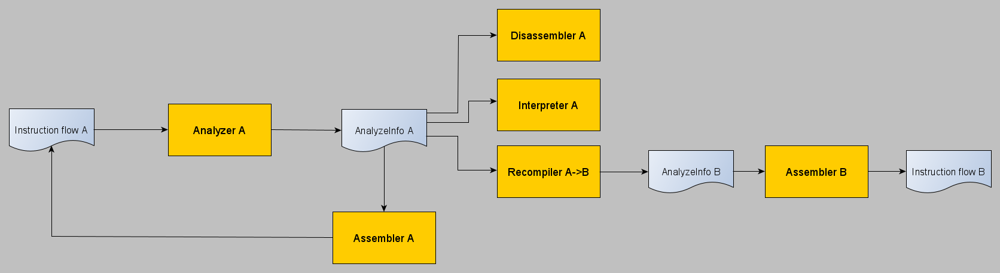

# Universal von Neumann Approach (UVNA)

Концепция, которая используется в эмуляторе Dolwin для эмуляции процессоров (DSP, Gekko).

## Предисловие

Все современные аппаратные архитектуры построены на архитектуре фон Неймана (https://en.wikipedia.org/wiki/Von_Neumann_architecture).

А поскольку это универсальный подход, то и подход к эмуляции также можно сделать универсальным.

## UVNA in a Nutshell

Эмуляцию любого процессора можно представить в виде следующей диаграммы:

- Поток инструкций архитектуры `A` подается на вход анализатора
- На выходе анализатора получается структура, в которой находится вся информация о текущей инструкции (`AnalyzeInfo`)
- Структура `AnalyzeInfo` может использоваться потребителями: дизассемблером, интерпретатором, рекомпилятором или ассемблером

## Дизассемблер

Переводит информацию в человеко-читаемый формат (строку).

## Интерпретатор

Эмулирует выполнение инструкций, с требуемой точностью, как это делается на реальном процессоре.

## Рекомпилятор

Производит конверсию структуры `AnalyzeInfo` архитектуры `A` в структуру `AnalyzeInfo` архитектуры `B`.

## Ассемблер

Делает обратное преобразование: из структуры `AnalyzeInfo` получается исполняемый код соответствующей архитектуры.
