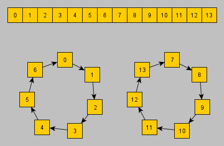

# GAMECUBE DSP Core

All previous documents considered the DSP core inseparably from its hardware connection (Mailbox, Accelerator). This document concentrates specifically on the DSP processor part, without specifying which DSP core interrupts are involved, for example, for the Accelerator, or how hardware registers are mapped to the DSP core memory.

Before reading this document, keep in mind that all DSP designers and programmers have a special alien mindset. They save on everything (on bits, on parallel execution of instructions etc). This can be easily traced by visiting any forum where they live. As a result, the software model for working with DSP has maximum entropy and looks very complicated to understand. But when all knowledge is formalized in the head, everything looks quite logical and simple.

## Registers

|Index|Name|Meaning|
|---|---|---|
|0|r0|Address register 0 (circular addressing)|
|1|r1|Address register 1 (circular addressing)|
|2|r2|Address register 2 (circular addressing)|
|3|r3|Address register 3 (circular addressing)|
|4|m0|Modifier value 0 (circular addressing)|
|5|m1|Modifier value 1 (circular addressing)|
|6|m2|Modifier value 2 (circular addressing)|
|7|m3|Modifier value 3 (circular addressing)|
|8|l0|Buffer length 0 (circular addressing)|
|9|l1|Buffer length 1 (circular addressing)|
|10|l2|Buffer length 2 (circular addressing)|
|11|l3|Buffer length 3 (circular addressing)|
|12|pcs|Program counter stack|
|13|pss|Program status stack|
|14|eas|End address stack|
|15|lcs|Loop count stack|
|16|a2|40-bit accumulator `a` high 8 bits|
|17|b2|40-bit accumulator `b` high 8 bits|
|18|dpp|Used as high 8-bits of address for some load/store instructions|
|19|psr|Program status register|
|20|ps0|Product partial sum low part|
|21|ps1|Product partial sum middle part|
|22|ps2|Product partial sum high part (8 bits)|
|23|pc1|Product partial carry 1 middle part|
|24|x0|ALU/Multiplier input operand `x` low part|
|25|y0|ALU/Multiplier input operand `y` low part|
|26|x1|ALU/Multiplier input operand `x` high part|
|27|y1|ALU/Multiplier input operand `y` high part|
|28|a0|40-bit accumulator `a` low 16 bits|
|29|b0|40-bit accumulator `b` low 16 bits|
|30|a1/a|40-bit accumulator `a` middle 16 bits / Whole `a` accumulator|
|31|b1/b|40-bit accumulator `b` middle 16 bits / Whole `b` accumulator|

Not all registers are associated with simple DFF stores. Reading/writing some of them triggers the work of internal circuits, and some are freaked out by themselves. Specifically:
- Stack registers implement a transparent LIFO mechanism for implementing hardware stacks
- The result of the multiplication is stored as a set of partial sums and carry. Upon request (in some instructions) these registers are "folded" into the full result, as written in the Duddie document. Why is this done? Well, most likely this is how the multiplier is implemented in HDL (it's easier to store intermediate results). The exact algorithm of the multiplier is unknown, but you can guess that these temporary results are collected from partial sums of multiplications between the upper and lower halves of the 16-bit operands.
- Registers a1/b1 have a special logic of operation associated with the PSR.XL bit.

## Processor Status Register (PSR) bits

|Name|Mask|Meaning|
|---|---|---|
|C|0x0001|Carry|
|V|0x0002|Overflow|
|Z|0x0004|Zero|
|N|0x0008|Negative|
|E|0x0010|Extension|
|U|0x0020|Unnormalization (~(result[31] ^ result[30]) != 0)|
|TB|0x0040|Test bit (btstl/btsth instructions)|
|SV|0x0080|Sticky overflow. Set together with the V overflow bit, can only be cleared by the `clr sv` instruction.|
|TE0|0x0100|Interrupt enable 0 (reserved)|
|TE1|0x0200|Interrupt enable 1|
|TE2|0x0400|Interrupt enable 2|
|TE3|0x0800|Interrupt enable 3|
|ET|0x1000|Global interrupt enable|
|IM|0x2000|Integer/fraction mode. 0: fraction mode, 1: integer mode. In fraction mode, the output of the multiplier is shifted left 1 bit to remove the sign.|
|XL|0x4000|Extension limit mode. Affects the loading and saving of a/b operands. See below.|
|DP|0x8000|Double precision mode. Affects mixed multiply (xxxMPY) instructions. When DP = 1, some of the operands of these instructions are signed and some are unsigned. Used to efficiently multiply two 32-bit signed numbers.|

## XL Mode

XL=0: Operands a/b are treated as registers a1/b1.

XL=1:
- Load a/b: The data is loaded into registers a1/b1 and sign extended into registers a2/b2.
- Store a/b: If (V | E) != 0 a/b output is clamped to 0x7fff/0x8000 according to sign.

This feature is used in DSP processing, for example, for clamping samples (e.g. one of the ADPCM stages).

## Circular Addressing

DSP contains hardware implementation of circular buffers. A total of 4 circular buffers are supported.

Each circular buffer is specified by a set of corresponding registers: r (Current address), m (Modifier) and l (Buffer Length).

Registers r and l are 16-bit unsigned numbers, register m is a 16-bit signed number.
The real size of the buffer is equal to the value in register l + 1.
If the l value is 0xFFFF, this mode is called linear and does not differ from the work of buffers in the usual sense.

To understand how circular buffers work, take a look at the image where the buffer size is 7 (l = 6):



How to express this algorithmically, try to figure it out for yourself, this is a really unusual task that Non-DSP programmers do not face every day.

Here are some values for a unit test:

|r|l|m|next r|
|---|---|---|---|
|0|0xffff|+1|1|
|1|0xffff|-1|0|
|0|0xffff|-1|0xffff|
|0x8000|0xffff|-1|0x7fff|
|0x8000|0xffff|+1|0x8001|
|5|6|+1|6|
|6|6|+1|0|
|0|6|-1|6|
|0xffff|6|-2|4|
|0xffff|6|+6|0xfffe|
|11|6|+3|7|
|11|6|-5|13|
|11|6|+14|11|
|11|6|-11|7|

## Stack operation

DSP contains 4 hardware stacks:
- Program counter stack
- Program status stack
- End address stack
- Loop count stack

The nesting depth of all stacks is 4, except for the Program counter stack, which is 8.

An attempt to push to a full stack or an attempt to Pop from an empty stack generates an ERR interrupt.

The user can force pop and push values onto the stack using the LD and ST instructions and the corresponding stack registers.

It is also a feature that End address stack and Loop count stack have a common stack pointer.

## Condition code

Used in conditional flow control instructions.

|cc|Name|Meaning|
|---|---|---|
|0b0000|ge|N ^ V == 0|
|0b0001|lt|N ^ V != 0|
|0b0010|gt|Z \| (N ^ V) == 0|
|0b0011|le|Z \| (N ^ V) != 0|
|0b0100|nz|Z == 0|
|0b0101|z|Z != 0|
|0b0110|nc|C == 0|
|0b0111|c|C != 0|
|0b1000|ne|E == 0|
|0b1001|e|E != 0|
|0b1010|nm|Z \| (~U & ~E) == 0|
|0b1011|m|Z \| (~U & ~E) != 0|
|0b1100|nt|TB == 0|
|0b1101|t|TB != 0|
|0b1110|v|V != 0|
|0b1111| |Uncoditionally (always)|

## Interrupt vectors

|Address|Name|
|---|---|
|0x0000|Reset (highest prority)|
|0x0002|Error|
|0x0004|Trap|
|0x0006|Accelerator read start (ACRS) (enabled by TE1)|
|0x0008|Accelerator write end (ACWE) (enabled by TE1)|
|0x000A|Decoder read end (DCRE) (enabled by TE1)|
|0x000C|AI DMA interrupt (enabled by TE2)|
|0x000E|CPU->DSP interrupt (enabled by TE3) (lowest priority)|

ACRS, ACWE and DCRE are shared by single interrupt enable bit (TE1). Also, these (ACRS, ACWE and DCRE) interrupts are generated regardless of whether the ET bit is set or cleared (controlled only by the TE1 bit)

## Flag modify rules

- C1: `(Ds(39) & S(39)) | (~Dd(39) & (Ds(39) | S(39)) )`
- C2: `(Ds(39) & ~S(39)) | (~Dd(39) & (Ds(39) | ~S(39)) )`
- C3: `Ds(39) ^ S(15) != 0 ? (Ds(39) & S(15)) | (~Dd(39) & (Ds(39) | S(15)) ) : (Ds(39) & ~S(15)) | (~Dd(39) & (Ds(39) | ~S(15)) )`
- C4: `~Ds(39) & ~Dd(39)`
- C5: `Ds(39) ^ S(31) == 0 ? (Ds(39) & S(39)) | (~Dd(39) & (Ds(39) | S(39)) ) : (Ds(39) & ~S(39)) | (~Dd(39) & (Ds(39) | ~S(39)) )`
- C6: `Ds(39) & ~Dd(39)`
- C7: `P(39) & ~D(39)`
- C8: `(P(39) & S(39)) | (~D(39) & (P(39) | S(39)) )`
- V1: `(Ds(39) & S(39) & ~Dd(39)) | (~Ds(39) & ~S(39) & Dd(39))`
- V2: `(Ds(39) & ~S(39) & ~Dd(39)) | (~Ds(39) & S(39) & Dd(39))`
- V3: `Ds(39) & Dd(39)`
- V4: `~Ds(39) & Dd(39)`
- V5: `Dd(39)`
- V6: `~P(39) & D(39)`
- V7: `(P(39) & S(39) & ~D(39)) | (~P(39) & ~S(39) & D(39))`
- V8: `Ds(39) & ~Dd(39)`
- Z1: `Dd == 0`
- Z2: `Dd(31-16) == 0`
- Z3: `Dd(39-0) == 0`
- N1: `Dd(39)`
- N2: `Dd(31)`
- E1: `Dd(39-31) != (0b0'0000'0000 || 0b1'1111'1111)`
- U1: `~( Dd(31) ^ Dd(30) )`

## Regular Instructions

|Syntax|Encoding|C|V|Z|N|E|U|Operation|Cycles|
|---|---|---|---|---|---|---|---|---|---|
|jmp(cc) ta|0000 0010 1001 cccc aaaa aaaa aaaa aaaa|-|-|-|-|-|-|Jump conditionally address|2: cc true, 3: cc false|
|jmp(cc) rn|0001 0111 0rr0 cccc|-|-|-|-|-|-|Jump conditionally rn|2|
|call(cc) ta|0000 0010 1011 cccc aaaa aaaa aaaa aaaa|-|-|-|-|-|-|Call conditionally address|2: cc true, 3: cc false|
|call(cc) rn|0001 0111 0rr1 cccc|-|-|-|-|-|-|Call conditionally rn|2|
|rets(cc)|0000 0010 1101 cccc|-|-|-|-|-|-|Return conditionally|2|
|reti(cc)|0000 0010 1111 cccc|\*|\*|\*|\*|\*|\*|Return interrupt conditionally (PSR reloaded)|2|
|trap|0000 0000 0010 0000|-|-|-|-|-|-|Trap|3|
|wait|0000 0000 0010 0001|-|-|-|-|-|-|Wait any interrupt|Any|
|exec(cc)|0000 0010 0111 cccc|-|-|-|-|-|-|Execute next instruction conditionally|1|
|loop lc,ea|0001 0001 cccc cccc aaaa aaaa aaaa aaaa|-|-|-|-|-|-|Loop by immeditate until end address|2|
|loop reg,ea|0000 0000 011r rrrr aaaa aaaa aaaa aaaa|-|-|-|-|-|-|Loop by reg until end address|2|
|rep rc|0001 0000 cccc cccc|-|-|-|-|-|-|Repeat next instruction by immediate|1|
|rep reg|0000 0000 010r rrrr|-|-|-|-|-|-|Repeat next instruction by register|1|
|pld d,rn,mn|0000 001d 0001 mmrr|-|-|-|-|-|-|Load from IMEM|3|
|nop|0000 0000 0000 0000|-|-|-|-|-|-|No operation|1|
|mr rn,mn|0000 0000 000m mmrr|-|-|-|-|-|-|Modify address register (non-parallel)|1|
|adsi d,si|0000 010d iiii iiii|C1|V1|Z1|N1|E1|U1|Add short immediate|1|
|adli d,li|0000 001d 0000 0000 iiii iiii iiii iiii|C1|V1|Z1|N1|E1|U1|Add long immediate|2|
|cmpsi s,si|0000 011s iiii iiii|C2|V2|Z1|N1|E1|U1|Compare short immediate|1|
|cmpli s,li|0000 001s 1000 0000 iiii iiii iiii iiii|C2|V2|Z1|N1|E1|U1|Compare long immediate|2|
|lsfi d,si|0001 010d 0iii iiii|0|0|Z1|N1|E1|U1|Logic shift immediate (directed by sign)|1|
|asfi d,si|0001 010d 1iii iiii|0|0|Z1|N1|E1|U1|Arithmetic shift immediate (directed by sign)|1|
|xorli d,li|0000 001d 0010 0000 iiii iiii iiii iiii|0|0|Z2|N2|E1|U1|Xor long immediate|2|
|anli d,li|0000 001d 0100 0000 iiii iiii iiii iiii|0|0|Z2|N2|E1|U1|And long immediate|2|
|orli d,li|0000 001d 0110 0000 iiii iiii iiii iiii|0|0|Z2|N2|E1|U1|Or long immediate|2|
|norm d,rn|0000 001d 0000 01rr|0|0|Z1|N1|E1|U1|Normalize step|1|
|div d,s|0000 001d 0ss0 1000|C3|0|Z3|N1|E1|U1|Division step|1|
|addc d,s|0000 001d 10s0 1100|C1|V1|Z1|N1|E1|U1|Add with carry|1|
|subc d,s|0000 001d 10s0 1101|C2|V2|Z1|N1|E1|U1|Sub with carry|1|
|negc d|0000 001d 0000 1101|C4|V3|Z1|N1|E1|U1|Negate with carry|1|
|max d,s|0000 001d 0ss0 1001|C5|0|Z1|N1|E1|U1|Max|1|
|lsf d,s|0000 001d 01s0 1010|0|0|Z1|N1|E1|U1|Logic shift directed by sign (Form 1)|1|
|lsf d,s|0000 001d 1100 1010|0|0|Z1|N1|E1|U1|Logic shift directed by sign (Form 2)|1|
|asf d,s|0000 001d 01s0 1011|0|0|Z1|N1|E1|U1|Arithmetic shift directed by sign (Form 1)|1|
|asf d,s|0000 001d 1100 1011|0|0|Z1|N1|E1|U1|Arithmetic shift directed by sign (Form 2)|1|
|ld d,r,m|0001 100m mrrd dddd|-|-|-|-|-|-|Load from DMEM|1|
|st r,m,s|0001 101m mrrs ssss|-|-|-|-|-|-|Store to DMEM|1|
|ldsa d,sa|0010 0ddd aaaa aaaa|-|-|-|-|-|-|Load from DMEM by short address|1|
|stsa sa,s|0010 1sss aaaa aaaa|-|-|-|-|-|-|Store to DMEM by short address|1|
|ldla d,la|0000 0000 110d dddd aaaa aaaa aaaa aaaa|-|-|-|-|-|-|Load from DMEM by long address|2|
|stla la,s|0000 0000 111s ssss aaaa aaaa aaaa aaaa|-|-|-|-|-|-|Store to DMEM by long address|2|
|mv d,s|0001 11dd ddds ssss|-|-|-|-|-|-|Move register (non-parallel)|1|
|mvsi d,si|0000 1ddd iiii iiii|-|-|-|-|-|-|Move short immediate|1|
|mvli d,li|0000 0000 100d dddd iiii iiii iiii iiii|-|-|-|-|-|-|Move long immediate|2|
|stli sa,li|0001 0110 aaaa aaaa iiii iiii iiii iiii|-|-|-|-|-|-|Store long immedate to DMEM by short address (high bits of address are 0xFF)|2|
|clr b|0001 0010 0000 0bbb|-|-|-|-|-|-|Clear PSR bit|1|
|set b|0001 0011 0000 0bbb|-|-|-|-|-|-|Set PSR bit|1|
|btstl d,bs|0000 001d 1010 0000 bbbb bbbb bbbb bbbb|-|-|-|-|-|-|Test bit clear(low)|2|
|btsth d,bs|0000 001d 1100 0000 bbbb bbbb bbbb bbbb|-|-|-|-|-|-|Test bit set(high)|2|

## Parallel Instructions

Can be mixed with parallel load/store/move instructions (see next section).

Note that instructions starting with 0b0011 (logical operations) take an extra bit (lsb7), which is usually occupied by paired load/store/move instructions. This fact was not noticed by Duddie as it is not obvious.

|Syntax|Encoding|C|V|Z|N|E|U|Operation|Cycles|
|---|---|---|---|---|---|---|---|---|---|
|add d,s|0100 sssd xxxx xxxx|C1|V1|Z1|N1|E1|U1|Add|1|
|addl d,s|0111 00sd xxxx xxxx|C6|V4|Z1|N1|E1|U1|Add to accumulator low word|1|
|sub d,s|0101 sssd xxxx xxxx|C2|V2|Z1|N1|E1|U1|Sub|1|
|amv d,s|0110 sssd xxxx xxxx|0|0|Z1|N1|E1|U1|Arithmetic move|1|
|cmp d,s|110s d001 xxxx xxxx|C2|V2|Z1|N1|E1|U1|Compare|1|
|cmp a,b|1000 0010 xxxx xxxx|C2|V2|Z1|N1|E1|U1|Compare accumulator|1|
|inc d|0111 01dd xxxx xxxx|C6|V4|Z1|N1|E1|U1|Increment|1|
|dec d|0111 10dd xxxx xxxx|C4|V8|Z1|N1|E1|U1|Decrement|1|
|abs d|1010 d001 xxxx xxxx|0|V5|Z1|N1|E1|U1|Absolute value|1|
|neg d|0111 110d xxxx xxxx|C4|V3|Z1|N1|E1|U1|Negate|1|
|neg d,p|0111 111d xxxx xxxx|C4|V3|Z1|N1|E1|U1|Negate by product|1|
|clr d|1000 d001 xxxx xxxx|0|0|1|0|0|1|Clear accumulator|1|
|clr p|1000 0100 xxxx xxxx|-|-|-|-|-|-|Clear product|1|
|rnd d|1111 110d xxxx xxxx|C6|V4|Z1|N1|E1|U1|Round accumulator|1|
|rndp d|1111 111d xxxx xxxx|C7|V6|Z1|N1|E1|U1|Round product|1|
|tst s|1011 s001 xxxx xxxx|0|0|Z1|N1|E1|U1|Test (Form 1)|1|
|tst s|1000 011s xxxx xxxx|0|0|Z1|N1|E1|U1|Test (Form 2)|1|
|tst p|1000 0101 xxxx xxxx|0|0|Z1|N1|E1|U1|Test product|1|
|lsl16 d|1111 000d xxxx xxxx|0|0|Z1|N1|E1|U1|Logical shift left 16|1|
|lsr16 d|1111 010d xxxx xxxx|0|0|Z1|N1|E1|U1|Logical shift right 16|1|
|asr16 d|1001 d001 xxxx xxxx|0|0|Z1|N1|E1|U1|Arithmetic shift right 16|1|
|addp d,s|1111 10sd xxxx xxxx|C8|V7|Z1|N1|E1|U1|Add x/y with product|1|
|nop|1000 0000 xxxx xxxx|-|-|-|-|-|-|Parallel nop|1|
|clr im|1000 1010 xxxx xxxx|-|-|-|-|-|-|Clear IM|1|
|clr dp|1000 1100 xxxx xxxx|-|-|-|-|-|-|Clear DP|1|
|clr xl|1000 1110 xxxx xxxx|-|-|-|-|-|-|Clear XL|1|
|set im|1000 1011 xxxx xxxx|-|-|-|-|-|-|Set IM|1|
|set dp|1000 1101 xxxx xxxx|-|-|-|-|-|-|Set DP|1|
|set xl|1000 1111 xxxx xxxx|-|-|-|-|-|-|Set XL|1|
|mpy s1,s2|1sss s000 xxxx xxxx|-|-|-|-|-|-|Mixed multiply (Form 1)|1|
|mpy x1,x1|1000 0011 xxxx xxxx|-|-|-|-|-|-|Mixed multiply x1\*x1 (Form 2)|1|
|mac s1,s2|1110 00ss xxxx xxxx|-|-|-|-|-|-|Multiply and accumulate (Form 1)|1|
|mac s1,s2|1110 10ss xxxx xxxx|-|-|-|-|-|-|Multiply and accumulate (Form 2)|1|
|mac s1,s2|1111 001s xxxx xxxx|-|-|-|-|-|-|Multiply and accumulate (Form 3)|1|
|macn s1,s2|1110 01ss xxxx xxxx|-|-|-|-|-|-|Multiply and accumulate with negation (Form 1)|1|
|macn s1,s2|1110 11ss xxxx xxxx|-|-|-|-|-|-|Multiply and accumulate with negation (Form 2)|1|
|macn s1,s2|1111 011s xxxx xxxx|-|-|-|-|-|-|Multiply and accumulate with negation (Form 3)|1|
|mvmpy d,s1,s2|1sss s11d xxxx xxxx|0|0|Z1|N1|E1|U1|Move product and mixed multiply|1|
|rnmpy d,s1,s2|1sss s01d xxxx xxxx|C7|V6|Z1|N1|E1|U1|Round product and mixed multiply|1|
|admpy d,s1,s2|1sss s10d xxxx xxxx|C1|V1|Z1|N1|E1|U1|Add product with destination and mixed multiply|1|
|not d|0011 001d 1xxx xxxx|0|0|Z2|N2|E1|U1|Logical not|1|
|xor d,s|0011 00sd 0xxx xxxx|0|0|Z2|N2|E1|U1|Logical xor (Form 1)|1|
|xor d,s|0011 000d 1xxx xxxx|0|0|Z2|N2|E1|U1|Logical xor (Form 2)|1|
|and d,s|0011 01sd 0xxx xxxx|0|0|Z2|N2|E1|U1|Logical and (Form 1)|1|
|and d,s|0011 110d 0xxx xxxx|0|0|Z2|N2|E1|U1|Logical and (Form 2)|1|
|or d,s|0011 10sd 0xxx xxxx|0|0|Z2|N2|E1|U1|Logical or (Form 1)|1|
|or d,s|0011 111d 0xxx xxxx|0|0|Z2|N2|E1|U1|Logical or (Form 2)|1|
|lsf d,s|0011 01sd 1xxx xxxx|0|0|Z1|N1|E1|U1|Logical shift directed by sign (Form 1)|1|
|lsf d,s|0011 110d 1xxx xxxx|0|0|Z1|N1|E1|U1|Logical shift directed by sign (Form 2)|1|
|asf d,s|0011 10sd 1xxx xxxx|0|0|Z1|N1|E1|U1|Arithmetic shift directed by sign (Form 1)|1|
|asf d,s|0011 111d 1xxx xxxx|0|0|Z1|N1|E1|U1|Arithmetic shift directed by sign (Form 2)|1|

## Parallel Load/Store/Move Instructions

|Syntax|Encoding|C|V|Z|N|E|U|Operation|Cycles|
|---|---|---|---|---|---|---|---|---|---|
|ldd d1,rn,mn d2,r3,m3|1xxx xxxx 11dd mnrr|-|-|-|-|-|-|Load dual data (Form 1a)|1|
|ldd d1,rn,mn d2,r3,m3|01xx xxxx 11dd mnrr|-|-|-|-|-|-|Load dual data (Form 1b)|1|
|ldd2 d1,rn,mn d2,r3,m3|1xxx xxxx 11rd mn11|-|-|-|-|-|-|Load dual data (Form 2)|1|
|ls d,r,m r,m,s|1xxx xxxx 10dd mn0s|-|-|-|-|-|-|Load and store (Form 1a)|1|
|ls d,r,m r,m,s|01xx xxxx 10dd mn0s|-|-|-|-|-|-|Load and store (Form 1b)|1|
|ls2 d,r,m r,m,s|1xxx xxxx 10dd mn1s|-|-|-|-|-|-|Load and store (Form 2a)|1|
|ls2 d,r,m r,m,s|01xx xxxx 10dd mn1s|-|-|-|-|-|-|Load and store (Form 2b)|1|
|ld d,rn,mn|1xxx xxxx 01dd dmrr|-|-|-|-|-|-|Load (Form 1a)|1|
|ld d,rn,mn|01xx xxxx 01dd dmrr|-|-|-|-|-|-|Load (Form 1b)|1|
|ld d,rn,mn|0011 xxxx x1dd dmrr|-|-|-|-|-|-|Load (Form 1c)|1|
|st rn,mn,s|1xxx xxxx 001s smrr|-|-|-|-|-|-|Store (Form 1a)|1|
|st rn,mn,s|01xx xxxx 001s smrr|-|-|-|-|-|-|Store (Form 1b)|1|
|st rn,mn,s|0011 xxxx x01s smrr|-|-|-|-|-|-|Store (Form 1c)|1|
|mv d,s|1xxx xxxx 0001 ddss|-|-|-|-|-|-|Parallel Move (Form 1a)|1|
|mv d,s|01xx xxxx 0001 ddss|-|-|-|-|-|-|Parallel Move (Form 1b)|1|
|mv d,s|0011 xxxx x001 ddss|-|-|-|-|-|-|Parallel Move (Form 1c)|1|
|mr rn,mn|1xxx xxxx 0000 mmrr|-|-|-|-|-|-|Parallel modify address register (Form 1a)|1|
|mr rn,mn|01xx xxxx 0000 mmrr|-|-|-|-|-|-|Parallel modify address register (Form 1b)|1|
|mr rn,mn|0011 xxxx x000 mmrr|-|-|-|-|-|-|Parallel modify address register (Form 1c)|1|

## Regular Instructions Operation Notes

These notes look a little incomprehensible, but if you are reading this document and started digging the DSP, they will help you understand the non-obvious points of the execution of DSP instructions.

The description is given in the form of pseudocode and mnemonic schemes.

### jmp

```
if (Condition() == true) PC = ta;
else PC = PC + 2;
```

### jmp r

|rr|Register|
|---|---|
|00|r0|
|01|r1|
|10|r2|
|11|r3|

```
if (Condition() == true) PC = rn;
else PC = PC + 1;
```

### call

```
if (Condition() == true)
{
	pcs <- PC + 2; 	// Push return address on PC Stack	
	PC = ta;
}
else PC = PC + 2;
```

### call r

rn parameter is same as `jmp r`.

```
if (Condition() == true)
{
	pcs <- PC + 1; 	// Push return address on PC Stack	
	PC = rn;
}
else PC = PC + 1;
```

### rets

```
if (Condition() == true)
{
	PC <- pcs; 	// Pops from PC Stack
}
else PC = PC + 1;
```

### reti

```
if (Condition() == true)
{
	PC <- pcs; 	// Pops from PC Stack
	PSR <- pss; 	// Pops from PSR Stack
}
else PC = PC + 1;
```

### trap

```
pcs <- PC + 1; 		// Push return address
pss <- PSR; 		// Push PSR
PC = 0x0004;	
```

### wait

Wait until some unmasked interrupt occures. Disconnects the clock generator from the processor core, leaving only the interrupt check circuit active.

### exec

```
if (Condition() == true)
{
	PC = PC + 1;	// Execute next single-word instruction
}
else
{
	PC = PC + 2; 	// Skip next single-word instruction
}
```

### loop

```
pcs <- pc+2 (end_address parameter skip)
lcs <- lc
eas <- ea
```

The maximum nesting loop is 4.

The logic behind the loop is as follows:
- If pc is equal to eas then lcs = lcs - 1. If after that lcs is not equal to zero, then pc = pcs. Otherwise pop pcs/eas/lcs and pc = pc + 1 (exit the loop);
- If the parameter lc = 0, then accordingly no loop occurs, pc = end_address + 1 (the block is skipped)

Checking the current pc for loop is done only if the eas/lcs stack is not empty (eas and lcs stacks share a common stack pointer).

### loop r

Same as `loop`, but lc is taken from register.

### rep

Repeat `rc` times the next 1-cycle instruction. If rc == 0, then the next instruction is skipped.

To store the number of repeats, the DSP contains an internal repeat register, which is not directly accessible to the programmer.

```
rep()
{
	if (rc != 0)
	{
		repeat = rc;
		PC = PC + 1;
	}
	else
	{
		PC = PC + 2;		// Skip next 1-cycle instruction
	}
}

next_instr()
{
	// Execute 1-cycle instruction

	// ... executed

	if (repeat)
	{
		repeat = repeat - 1;
	}

	// If the value of the repeat register is not equal to 0, then instead of the usual PC increment, it is not performed.

	if (repeat != 0)
	{
		PC = PC;
	}
	else
	{
		PC = PC + 1;
	}
}
```

### rep r

Same as rep, but repeat count is taken from register.

LOOP and REP instructions can behave quite exotic if you insert control flow instructions (JMP, CALL) there in inconvenient places. Consider that DSP behavior will be unpredictable in this case and it is better not to do so.

### pld

|d|XL=0|XL=1|
|---|---|---|
|0|a1|a|
|1|b1|b|

|mn|r modify|
|---|---|
|00|0|
|01|-1|
|10|+1|
|11|+m|

|rn|Register|
|---|---|
|00|r0|
|01|r1|
|10|r2|
|11|r3|

```
a/b = READ_IMEM(rn)
rn = rn + (0,-1,+1,+m)
```

The index of the modified register `rn` corresponds to the index of the register `mn`. For example, if register r1 is used, it will be modified by register m1.

Modifications are made according to circular addressing rules.

### nop

```
PC = PC + 1
```

### mr (Regular)

|mn|modify|
|---|---|
|000|0|
|001|-1|
|010|+1|
|011|-m|
|100|+m0|
|101|+m1|
|110|+m2|
|111|+m3|

|rn|Register|
|---|---|
|00|r0|
|01|r1|
|10|r2|
|11|r3|

Modify rn by modifier.

### adsi

|d|Register|
|---|---|
|0|a|
|1|b|

Example (`a` accumulator):

```
[a2] [a1] [a0] = [a2] [a1] [a0] + [sign] [(int16_t)(int8_t)si] [0]
```

Quads represent parts of a long accumulator. The highest part (a2/b2) is 8 bits wide.

### adli

Example (`a` accumulator):

```
[a2] [a1] [a0] = [a2] [a1] [a0] + [sign] [(int16_t)li] [0]
```

### cmpsi

```
Flags <- [a2] [a1] [a0] - [sign] [(int16_t)(int8_t)si] [0]
```

### cmpli

```
Flags <- [a2] [a1] [a0] - [sign] [(int16_t)li] [0]
```

### lsfi

If si<0 shift a/b right by \~si + 1.

If si>0 shift a/b left by si.

### asfi

If si<0 arithmetic shift a/b right by \~si + 1.  (Extend msb39 while shifting)

If si>0 shift a/b left by si.

### xorli

|d|Register|
|---|---|
|0|a1|
|1|b1|

```
a1/b1 = a1/b1 ^ li
```

li is not sign-extended.

### anli

```
a1/b1 = a1/b1 & li
```

li is not sign-extended.

### orli

```
a1/b1 = a1/b1 | li
```

li is not sign-extended.

### norm

|d|Register|
|---|---|
|0|a|
|1|b|

|rn|Register|
|---|---|
|00|r0|
|01|r1|
|10|r2|
|11|r3|

```
if (E != 0)
{
	d = d >> 1; 		// Arithemic (extend sign)
	rn = rn + 1;
}
else if ( (~E & U & ~Z) != 0 )
{
	d = d << 1;
	rn = rn - 1;
}
else
{
	// Nop
}
```

### div

One step of non-recoverable division. After the operation, the quotient is in a1/b1, the remainder is in a0/b0. The remainder needs to be restored after the operation on your own.

As in many similar processors, division is performed by a series of successive shifts. Usually, for a complete division of s40 / s16, a large procedure is implemented that monitors the number of shifts and remainders.

|d|Register|
|---|---|
|0|a|
|1|b|

|s|Register|
|---|---|
|00|x0|
|01|y0|
|10|x1|
|11|y1|

```
if ((d39 ^ s15) == 0) 		// Same sign
{
	temp = (d - s); 	// Get CarryOut
	d = temp * 2 + (CarryOut ^ s15);
}
else
{
	temp = (d + s); 	// Get CarryOut
	d = temp * 2 + (CarryOut ^ s15);
}
```

`s` (x0/y0/x1/y1) is sign extended before addition/subtraction.

Example (div a, x0):

```
[a2] [a1] [a0] = [a2] [a1] [a0] +/- [sign] [x0] [0]
```

### addc

|d|Register|
|---|---|
|0|a|
|1|b|

|s|Register|
|---|---|
|0|x|
|1|y|

Example (addc a, x):

```
[a2] [a1] [a0] = [a2] [a1] [a0] + [sign] [x1] [x0] + PSR.C
```

### subc

Example (subc a, x):

```
[a2] [a1] [a0] = [a2] [a1] [a0] + ~([sign] [x1] [x0]) + PSR.C
```

### negc

|d|Register|
|---|---|
|0|a|
|1|b|

Example (negc a):

```
[a2] [a1] [a0] = [0] [0] [0] + ~([a2] [a1] [a0]) + PSR.C
```

### max

Absolute compare.

|d|Register|
|---|---|
|0|a|
|1|b|

|s|Register|
|---|---|
|00|x0|
|01|y0|
|10|x1|
|11|y1|

Example max a, x0:

```
Flags <- abs ( [a2] [a1] [a0]) - abs ( [sign] [x0] [0] )
```

### lsf (Regular Form 1)

|d|Register|
|---|---|
|0|a|
|1|b|

|s|Register|
|---|---|
|0|x1|
|1|y1|

If -s < 0 logic shift right d by s.

Else logic shift left d by \~s+1.

### lsf (Regular Form 2)

|d|Register|s|
|---|---|---|
|0|a|b1|
|1|b|a1|

If -s < 0 logic shift right d by s.

Else logic shift left d by \~s+1.

### asf (Regular Form 1)

|d|Register|
|---|---|
|0|a|
|1|b|

|s|Register|
|---|---|
|0|x1|
|1|y1|

If -s < 0 arithmetic shift right d by s.

Else shift left d by \~s+1.

### asf (Regular Form 2)

|d|Register|s|
|---|---|---|
|0|a|b1|
|1|b|a1|

If -s < 0 arithmetic shift right d by s.

Else shift left d by \~s+1.

### ld

|rn|Register|
|---|---|
|00|r0|
|01|r1|
|10|r2|
|11|r3|

|mn|r modify|
|---|---|
|00|0|
|01|-1|
|10|+1|
|11|+m|

```
d = READ_DMEM(rn);
rn = rn + (0,-1,+1,+m)
```

### st

|rn|Register|
|---|---|
|00|r0|
|01|r1|
|10|r2|
|11|r3|

|mn|r modify|
|---|---|
|00|0|
|01|-1|
|10|+1|
|11|+m|

```
WRITE_DMEM(rn, s)
rn = rn + (0,-1,+1,+m)
```

### ldsa

|d|Register|
|---|---|
|000|x0|
|001|y0|
|010|x1|
|011|y1|
|100|a0|
|101|b0|
|110|XL=0: a1, XL=1: a|
|111|XL=0: b1, XL=1: b|

```
d = READ_DMEM ( (dpp << 8) | sa)
```

### stsa

|s|Register|
|---|---|
|000|a2 (sign-extended to 16 bit)|
|001|b2 (sign-extended to 16 bit)|
|010|-|
|011|-|
|100|a0|
|101|b0|
|110|XL=0: a1, XL=1: a|
|111|XL=0: b1, XL=1: b|

```
WRITE_DMEM ((dpp << 8) | sa, s)
```

### ldla

```
d = READ_DMEM(la)
```

### stla

```
WRITE_DMEM(la, s)
```

Output from a2/b2 is sign-extended to 16-bit.

### mv (Regular)

```
d = s
```

### mvsi

|d|Register|
|---|---|
|000|x0|
|001|y0|
|010|x1|
|011|y1|
|100|a0|
|101|b0|
|110|XL=0: a1, XL=1: a|
|111|XL=0: b1, XL=1: b|

```
d = si
```

### mvli

```
d = li
```

### stli

```
WRITE_DMEM ( (0xFF00 | sa), li)
```

### clr b

Clear PSR bit.

|b|Bit|
|---|---|
|000|tb|
|001|sv|
|010|te0|
|011|te1|
|100|te2|
|101|te3|
|110|et|
|111|-|

### set b

Set PSR bit.

|b|Bit|
|---|---|
|000|tb|
|001|sv|
|010|te0|
|011|te1|
|100|te2|
|101|te3|
|110|et|
|111|-|

### btstl

Used to poll hardware registers.

|d|Register|
|---|---|
|0|a1|
|1|b1|

```
psr.tb = (d & BitMask) == 0
```

### btsth

Used to poll hardware registers.

|d|Register|
|---|---|
|0|a1|
|1|b1|

```
psr.tb = (d & BitMask) == BitMask
```

## Parallel Instructions Operation Notes

### add

|s|Register|
|---|---|
|000|x0|
|001|y0|
|010|x1|
|011|y1|
|100|x|
|101|y|
|110|b/a|
|111|p (Folded product)|

|d|Register|
|---|---|
|0|a|
|1|b|

```
d = d + s
```

Examples:

```
[a2] [a1] [a0] = [a2] [a1] [a0] + [sign] [x0] [0]    	(x0, y0, x1, y1)

[a2] [a1] [a0] = [a2] [a1] [a0] + [sign] [x1] [x0] 		(x, y)

[a2] [a1] [a0] = [a2] [a1] [a0] + [b2] [b1] [b0] 		(a,b or vice versa)

[a2] [a1] [a0] = [a2] [a1] [a0] + [p2] [p1] [p0] 		(p)
```

### addl

|s|Register|
|---|---|
|0|x0|
|1|y0|

|d|Register|
|---|---|
|0|a|
|1|b|

```
d = d + s

[a2] [a1] [a0] = [a2] [a1] [a0] + [0] [0] [x0]
```

### sub

Same as add, but d = d - s

### amv

The Move version that sets the PSR flags.

|s|Register|
|---|---|
|000|x0|
|001|y0|
|010|x1|
|011|y1|
|100|x|
|101|y|
|110|b/a|
|111|p (Folded product)|

|d|Register|
|---|---|
|0|a|
|1|b|

```
d = 0 + s
```

Examples:

```
[a2] [a1] [a0] = [0] [0] [0] + [sign] [x0] [0]    	(x0, y0, x1, y1)

[a2] [a1] [a0] = [0] [0] [0] + [sign] [x1] [x0] 	(x, y)

[a2] [a1] [a0] = [0] [0] [0] + [b2] [b1] [b0] 		(a,b or vice versa)

[a2] [a1] [a0] = [0] [0] [0] + [p2] [p1] [p0] 		(p)
```

### cmp

|s|Register|
|---|---|
|0|x1|
|1|y1|

|d|Register|
|---|---|
|0|a|
|1|b|

```
Flags <- [a2] [a1] [a0] - [sign] [x1] [0]
```

### cmp (Accumulator)

```
Flags <- [a2] [a1] [a0] - [b2] [b1] [b0]
```

### inc

|d|Register|
|---|---|
|00|a1|
|01|b1|
|10|a|
|11|b|

```
Flags <- [a2] [a1] [a0] + [0] [1] [0]   (a1/b1 version)

Flags <- [a2] [a1] [a0] + [0] [0] [1]   (a/b version)
```

### dec

|d|Register|
|---|---|
|00|a1|
|01|b1|
|10|a|
|11|b|

```
Flags <- [a2] [a1] [a0] - [0] [1] [0]   (a1/b1 version)

Flags <- [a2] [a1] [a0] - [0] [0] [1]   (a/b version)
```

### abs

|d|Register|
|---|---|
|0|a|
|1|b|

```
if ( d39 == 0 ) 		// >= 0
{
	d = 0 + d
}
else
{
	d = 0 - d
}
```

### neg

|d|Register|
|---|---|
|0|a|
|1|b|

```
d = 0 - d
```

### neg d,p

```
d = 0 - p 		// "Folded" product
```

### clr

|d|Register|
|---|---|
|0|a|
|1|b|

```
d = 0
```

### clr p

```
// p = Product_Zero 

ps0 = 0x0000
ps1 = 0xfff0
ps2 = 0x00ff
pc1 = 0x0010
```

### rnd

|d|Register|
|---|---|
|0|a|
|1|b|

```
if (d0 < 0x8000)
{
	d = d + 0x00'0000'0000;
	d0 = 0;	
}
else if (d0 > 0x8000)
{
	d = d + 0x00'0001'0000;
	d0 = 0;	
}
else 	// == 0x8000
{
	if (d16 == 0) 		// lsb of d1
	{
		d = d + 0x00'0000'0000;
		d0 = 0;	
	}
	else
	{
		d = d + 0x00'0001'0000;
		d0 = 0;	
	}
}
```

### rndp

|d|Register|
|---|---|
|0|a|
|1|b|

```
if (p0 < 0x8000)
{
	p = PackProd();
	d = p + 0x00'0000'0000;
	d0 = 0;
}
else if (p0 > 0x8000)
{
	p = PackProd();
	d = p + 0x00'0001'0000;
	d0 = 0;	
}
else 	// == 0x8000
{
	if (p16 == 0) 		// lsb of p1
	{
		p = PackProd();
		d = p + 0x00'0000'0000;
		d0 = 0;
	}
	else
	{
		p = PackProd();
		d = p + 0x00'0001'0000;
		d0 = 0;
	}
}

PackProd: p = ((ps2 << 24) | (ps1 << 16) | ps0) + (pc1 << 16)

```

### tst (Form 1)

|s|Register|
|---|---|
|0|a|
|1|b|

```
Flags <- [a2] [a1] [a0] + [0] [0] [0]
```

### tst (Form 2)

|s|Register|
|---|---|
|0|x1|
|1|y1|

```
Flags <- [sign] [x1] [0] + [0] [0] [0]
```

### tst p

Test multiply product.

```
Flags <- [ps2] [ps1] [ps0] + [0] [pc1] [0]
```

### lsl16

|d|Register|
|---|---|
|0|a|
|1|b|

```
a = a << 16
```

### lsr16

|d|Register|
|---|---|
|0|a|
|1|b|

```
a = a >> 16 		// Logic shift
```

### asr16

|d|Register|
|---|---|
|0|a|
|1|b|

```
a = a >>> 16 		// Arithmetic shift (propagate msb)
```

### addp

|s|Register|
|---|---|
|0|x1|
|1|y1|

|d|Register|
|---|---|
|0|a|
|1|b|

```
p = PackProd();

[a2] [a1] [a0] = [sign] [x1] [0] + [sign] [p1] [p0]
```

### nop (Parallel)

Do nothing.

### clr im

PSR.IM = 0

### clr dp

PSR.DP = 0

### clr xl

PSR.XL = 0

### set im

PSR.IM = 1

### set dp

PSR.DP = 1

### set xl

PSR.XL = 1

### mpy (Form 1)

|s|s1|s2|
|---|---|---|
|0010|x1|x0|
|0011|y1|y0|
|0100|x0|y0|
|0101|x0|y1|
|0110|x1|y0|
|0111|x1|y1|
|1000|a1|x1|
|1001|a1|y1|
|1010|b1|x1|
|1011|b1|y1|

- IM=1 (integer mode): p = s1 * s2
- IM=0 (fraction mode): p = s1 * (2 * s2)

When DP=1:

```
x0 * y0: unsigned * unsigned
x0 * y1: unsigned * signed
x1 * y0: signed * unsigned
x1 * y1: signed * signed
```

### mpy (Form 2)

Same as Form 1, but s1 = s2 = x1.

### mac (Form 1)

|s|s1|s2|
|---|---|---|
|00|x0|y0|
|01|x0|y1|
|10|x1|y0|
|11|x1|y1|

- IM=1 (integer mode): p = s1 * s2 + p
- IM=0 (fraction mode): p = s1 * (2 * s2) + p

```
[p2] [p1] [p0] = s1 * s2 + [p2] [p1] [p0]
```

### mac (Form 2)

|s|s1|s2|
|---|---|---|
|00|a1|x1|
|01|a1|y1|
|10|b1|x1|
|11|b1|y1|

### mac (Form 3)

|s|s1|s2|
|---|---|---|
|0|x1|x0|
|1|y1|y0|

### macn (Form 1)

Differs from `mac` instruction in that s1 parameter is minus sign.

|s|s1|s2|
|---|---|---|
|00|x0|y0|
|01|x0|y1|
|10|x1|y0|
|11|x1|y1|

- IM=1 (integer mode): p = -s1 * s2 + p
- IM=0 (fraction mode): p = -s1 * (2 * s2) + p

```
[p2] [p1] [p0] = -s1 * s2 + [p2] [p1] [p0]
```

### macn (Form 2)

|s|s1|s2|
|---|---|---|
|00|a1|x1|
|01|a1|y1|
|10|b1|x1|
|11|b1|y1|

### macn (Form 3)

|s|s1|s2|
|---|---|---|
|0|x1|x0|
|1|y1|y0|

### mvmpy

Differs from `mpy` instruction in that product is pre-stored in register a/b.

|s|s1|s2|
|---|---|---|
|0010|x1|x0|
|0011|y1|y0|
|0100|x0|y0|
|0101|x0|y1|
|0110|x1|y0|
|0111|x1|y1|
|1000|a1|x1|
|1001|a1|y1|
|1010|b1|x1|
|1011|b1|y1|

|d|Register|
|---|---|
|0|a|
|1|b|

- IM=1 (integer mode): d = p; p = s1 * s2
- IM=0 (fraction mode): d = p; p = s1 * (2 * s2)

When DP=1:

```
x0 * y0: unsigned * unsigned
x0 * y1: unsigned * signed
x1 * y0: signed * unsigned
x1 * y1: signed * signed
```

### rnmpy

|s|s1|s2|
|---|---|---|
|0010|x1|x0|
|0011|y1|y0|
|0100|x0|y0|
|0101|x0|y1|
|0110|x1|y0|
|0111|x1|y1|
|1000|a1|x1|
|1001|a1|y1|
|1010|b1|x1|
|1011|b1|y1|

|d|Register|
|---|---|
|0|a|
|1|b|

- IM=1 (integer mode): d = Rnd(p); p = s1 * s2
- IM=0 (fraction mode): d = Rnd(p); p = s1 * (2 * s2)

Convergent rounding method used (see `rnd` instruction).

When DP=1:

```
x0 * y0: unsigned * unsigned
x0 * y1: unsigned * signed
x1 * y0: signed * unsigned
x1 * y1: signed * signed
```

### admpy

|s|s1|s2|
|---|---|---|
|0010|x1|x0|
|0011|y1|y0|
|0100|x0|y0|
|0101|x0|y1|
|0110|x1|y0|
|0111|x1|y1|
|1000|a1|x1|
|1001|a1|y1|
|1010|b1|x1|
|1011|b1|y1|

|d|Register|
|---|---|
|0|a|
|1|b|

- IM=1 (integer mode): d = d + p; p = s1 * s2
- IM=0 (fraction mode): d = d + p; p = s1 * (2 * s2)

When DP=1:

```
x0 * y0: unsigned * unsigned
x0 * y1: unsigned * signed
x1 * y0: signed * unsigned
x1 * y1: signed * signed
```

### not

```
d = ~d;
```

|d|Register|
|---|---|
|0|a1|
|1|b1|

### xor (Form 1)

```
d = d ^ s
```

|d|Register|
|---|---|
|0|a1|
|1|b1|

|s|Register|
|---|---|
|0|x1|
|1|y1|

### xor (Form 2)

|d|Dest|Source|
|---|---|
|0|a1|b1|
|1|b1|a1|

### and (Form 1)

```
d = d & s
```

|d|Register|
|---|---|
|0|a1|
|1|b1|

|s|Register|
|---|---|
|0|x1|
|1|y1|

### and (Form 2)

|d|Dest|Source|
|---|---|
|0|a1|b1|
|1|b1|a1|

### or (Form 1)

```
d = d | s
```

|d|Register|
|---|---|
|0|a1|
|1|b1|

|s|Register|
|---|---|
|0|x1|
|1|y1|

### or (Form 2)

|d|Dest|Source|
|---|---|---|
|0|a1|b1|
|1|b1|a1|

### lsf (Parallel Form 1)

Logic shift. The shift direction is selected by the sign of the operand.

```
if (s < 0)
{
	d = d << (~s + 1);
}
else
{
	d = d >> s;
}
```

|d|Register|
|---|---|
|0|a|
|1|b|

|s|Register|
|---|---|
|0|x1|
|1|y1|

### lsf (Parallel Form 2)

|d|Dest|Source|
|---|---|---|
|0|a|b1|
|1|b|a1|

### asf (Parallel Form 1)

Arithmetic shift. The shift direction is selected by the sign of the operand.

```
if (s < 0)
{
	d = d <<< (~s + 1); 		// arithmetic shift
}
else
{
	d = d >>> s;			// arithmetic shift
}
```

|d|Register|
|---|---|
|0|a|
|1|b|

|s|Register|
|---|---|
|0|x1|
|1|y1|

### asf (Parallel Form 2)

|d|Dest|Source|
|---|---|---|
|0|a|b1|
|1|b|a1|

## Parallel Load/Store/Move Instructions Operation Notes

### ldd

```
d1 = (rn)
rn = rn + (1 or mn)

d2 = (r3)
r3 = r3 + (1 or m3)
```

|rr|rn|r3|
|---|---|---|
|00|r0|r3|
|01|r1|r3|
|10|r2|r3|

|dd|d1|d2|
|---|---|---|
|00|x0|y0|
|01|x0|y1|
|10|x1|y0|
|11|x1|y1|

|n (mn)|Meaning|
|---|---|
|0|+1|
|1|+m|

|m (m3)|Meaning|
|---|---|
|0|+1|
|1|+m|

### ldd2

The instruction is actually called `ldd`, but I've renamed it for clarity.

|r|rn|r3|
|---|---|---|
|0|r0|r3|
|1|r1|r3|

|d|d1|d2|
|---|---|---|
|0|x1|x0|
|1|y1|y0|

|n (mn)|Meaning|
|---|---|
|0|+1|
|1|+m|

|m (m3)|Meaning|
|---|---|
|0|+1|
|1|+m|

### ls

Load by r0, store by r3.

```
d = (r0)
r0 = r0 + (1 or m0)
(r3) = s
r3 = r3 + (1 or m3)
```

|d|Register|
|---|---|
|00|x0|
|01|y0|
|10|x1|
|11|y1|

|s|XL=1|XL=0|
|---|---|---|
|0|a|a1|
|1|b|b1|

|n (m0)|Meaning|
|---|---|
|0|+1|
|1|+m|

|m (m3)|Meaning|
|---|---|
|0|+1|
|1|+m|

### ls2

The instruction is actually called `ls`, but I've renamed it for clarity.

Load by r3, store by r0.

```
d = (r3)
r3 = r3 + (1 or m3)
(r0) = s
r0 = r0 + (1 or m0)
```

|d|Register|
|---|---|
|00|x0|
|01|y0|
|10|x1|
|11|y1|

|s|XL=1|XL=0|
|---|---|---|
|0|a|a1|
|1|b|b1|

|n (m0)|Meaning|
|---|---|
|0|+1|
|1|+m|

|m (m3)|Meaning|
|---|---|
|0|+1|
|1|+m|

### ld (Parallel)

```
d = (rn)
rn = rn + (1 or mn)
```

|rn|Register|
|---|---|
|00|r0|
|01|r1|
|10|r2|
|11|r3|

|mn|Meaning|
|---|---|
|0|+1|
|1|+m|

|d|Register|
|---|---|
|000|x0|
|001|y0|
|010|x1|
|011|y1|
|100|a0|
|101|b0|
|110|XL=1: a, XL=0: a1|
|111|XL=1: b, XL=0: b1|

### st (Parallel)

```
(rn) = s
rn = rn + (1 or mn)
```

|rn|Register|
|---|---|
|00|r0|
|01|r1|
|10|r2|
|11|r3|

|mn|Meaning|
|---|---|
|0|+1|
|1|+m|

|s|Register|
|---|---|
|00|a0|
|01|b0|
|10|XL=1: a1, XL=0: a|
|11|XL=1: b1, XL=0: b|

### mv (Parallel)

d = s

|d|Register|
|---|---|
|00|x0|
|01|y0|
|10|x1|
|11|y1|

|s|Register|
|---|---|
|00|a0|
|01|b0|
|10|XL=1: a1, XL=0: a|
|11|XL=1: b1, XL=0: b|

### mr (Parallel)

```
rn = rn + (+0 or -1 or +1 or +mn)
```

|mn|Meaning|
|---|---|
|00|+0|
|01|-1|
|10|+1|
|11|+m|

|rn|Register|
|---|---|
|00|r0|
|01|r1|
|10|r2|
|11|r3|

## Instructions sorted by opcode

### Regular Instructions

|Syntax|Encoding|
|---|---|
|Group 0| |
|nop         |0000 0000 0000 0000|
|mr rn,mn    |0000 0000 000m mmrr|
|trap        |0000 0000 0010 0000|
|wait        |0000 0000 0010 0001|
|rep reg     |0000 0000 010r rrrr|
|loop reg,ea |0000 0000 011r rrrr aaaa aaaa aaaa aaaa|
|mvli d,li   |0000 0000 100d dddd iiii iiii iiii iiii|
|ldla d,la   |0000 0000 110d dddd aaaa aaaa aaaa aaaa|
|stla la,s   |0000 0000 111s ssss aaaa aaaa aaaa aaaa|
|adli d,li   |0000 001d 0000 0000 iiii iiii iiii iiii|
|norm d,rn   |0000 001d 0000 01rr|
|negc d      |0000 001d 0000 1101|
|pld d,rn,mn |0000 001d 0001 mmrr|
|xorli d,li  |0000 001d 0010 0000 iiii iiii iiii iiii|
|anli d,li   |0000 001d 0100 0000 iiii iiii iiii iiii|
|orli d,li   |0000 001d 0110 0000 iiii iiii iiii iiii|
|div d,s     |0000 001d 0ss0 1000|
|max d,s     |0000 001d 0ss0 1001|
|lsf d,s     |0000 001d 01s0 1010|
|asf d,s     |0000 001d 01s0 1011|
|exec(cc)    |0000 0010 0111 cccc|
|cmpli s,li  |0000 001s 1000 0000 iiii iiii iiii iiii|
|addc d,s    |0000 001d 10s0 1100|
|subc d,s    |0000 001d 10s0 1101|
|jmp(cc) ta  |0000 0010 1001 cccc aaaa aaaa aaaa aaaa|
|btstl d,bs  |0000 001d 1010 0000 bbbb bbbb bbbb bbbb|
|call(cc) ta |0000 0010 1011 cccc aaaa aaaa aaaa aaaa|
|btsth d,bs  |0000 001d 1100 0000 bbbb bbbb bbbb bbbb|
|lsf d,s     |0000 001d 1100 1010|
|asf d,s     |0000 001d 1100 1011|
|rets(cc)    |0000 0010 1101 cccc|
|reti(cc)    |0000 0010 1111 cccc|
|adsi d,si   |0000 010d iiii iiii|
|cmpsi s,si  |0000 011s iiii iiii|
|mvsi d,si   |0000 1ddd iiii iiii|
|Group 1| |
|rep rc      |0001 0000 cccc cccc|
|loop lc,ea  |0001 0001 cccc cccc aaaa aaaa aaaa aaaa|
|clr b       |0001 0010 0000 0bbb|
|set b       |0001 0011 0000 0bbb|
|lsfi d,si   |0001 010d 0iii iiii|
|asfi d,si   |0001 010d 1iii iiii|
|stli sa,li  |0001 0110 aaaa aaaa iiii iiii iiii iiii|
|jmpr(cc) rn |0001 0111 0rr0 cccc|
|callr(cc) rn|0001 0111 0rr1 cccc|
|ld d,r,m    |0001 100m mrrd dddd|
|st r,m,s    |0001 101m mrrs ssss|
|mv d,s      |0001 11dd ddds ssss|
|Group 2| |
|ldsa d,sa   |0010 0ddd aaaa aaaa|
|stsa sa,s   |0010 1sss aaaa aaaa|

### Parallel Instructions

|Syntax|Encoding|
|---|---|
|Group 3| |
|xor d,s      |0011 00sd 0xxx xxxx|
|xor d,s      |0011 000d 1xxx xxxx|
|not d        |0011 001d 1xxx xxxx|
|and d,s      |0011 01sd 0xxx xxxx|
|lsf d,s      |0011 01sd 1xxx xxxx|
|or d,s       |0011 10sd 0xxx xxxx|
|asf d,s      |0011 10sd 1xxx xxxx|
|and d,s      |0011 110d 0xxx xxxx|
|lsf d,s      |0011 110d 1xxx xxxx|
|or d,s       |0011 111d 0xxx xxxx|
|asf d,s      |0011 111d 1xxx xxxx|
|Group 4| |
|add d,s      |0100 sssd xxxx xxxx|
|Group 5| |
|sub d,s      |0101 sssd xxxx xxxx|
|Group 6| |
|amv d,s      |0110 sssd xxxx xxxx|
|Group 7| |
|addl d,s     |0111 00sd xxxx xxxx|
|inc d        |0111 01dd xxxx xxxx|
|dec d        |0111 10dd xxxx xxxx|
|neg d        |0111 110d xxxx xxxx|
|neg d,p      |0111 111d xxxx xxxx|
|Group 8| |
|nop          |1000 0000 xxxx xxxx|
|clr d        |1000 d001 xxxx xxxx|
|cmp a,b      |1000 0010 xxxx xxxx|
|mpy x1,x1    |1000 0011 xxxx xxxx|
|clr p        |1000 0100 xxxx xxxx|
|tst p        |1000 0101 xxxx xxxx|
|tst s        |1000 011s xxxx xxxx|
|clr im       |1000 1010 xxxx xxxx|
|set im       |1000 1011 xxxx xxxx|
|clr dp       |1000 1100 xxxx xxxx|
|set dp       |1000 1101 xxxx xxxx|
|clr xl       |1000 1110 xxxx xxxx|
|set xl       |1000 1111 xxxx xxxx|
|Group 9| |
|asr16 d      |1001 d001 xxxx xxxx|
|Group A| |
|abs d        |1010 d001 xxxx xxxx|
|Group B| |
|tst s        |1011 s001 xxxx xxxx|
|Group CD| |
|cmp d,s      |110s d001 xxxx xxxx|
|Group E| |
|mac s1,s2    |1110 00ss xxxx xxxx|
|mac s1,s2    |1110 10ss xxxx xxxx|
|macn s1,s2   |1110 01ss xxxx xxxx|
|macn s1,s2   |1110 11ss xxxx xxxx|
|Group F| |
|lsl16 d      |1111 000d xxxx xxxx|
|mac s1,s2    |1111 001s xxxx xxxx|
|lsr16 d      |1111 010d xxxx xxxx|
|macn s1,s2   |1111 011s xxxx xxxx|
|addp d,s     |1111 10sd xxxx xxxx|
|rnd d        |1111 110d xxxx xxxx|
|rndp d       |1111 111d xxxx xxxx|
|Group mixed multiply (8-F)| |
|mpy s1,s2    |1sss s000 xxxx xxxx|
|rnmpy d,s1,s2|1sss s01d xxxx xxxx|
|admpy d,s1,s2|1sss s10d xxxx xxxx|
|mvmpy d,s1,s2|1sss s11d xxxx xxxx|

### Parallel Load/Store/Move Instructions

|Syntax|Encoding|
|---|---|
|7-bit parralel mem ops| |
|mr rn,mn               |0011 xxxx x000 mmrr|
|mv d,s                 |0011 xxxx x001 ddss|
|st rn,mn,s             |0011 xxxx x01s smrr|
|ld d,rn,mn             |0011 xxxx x1dd dmrr|
|8-bit parralel mem ops| |
|mr rn,mn               |01xx xxxx 0000 mmrr|
|mr rn,mn               |1xxx xxxx 0000 mmrr|
|mv d,s                 |01xx xxxx 0001 ddss|
|mv d,s                 |1xxx xxxx 0001 ddss|
|st rn,mn,s             |01xx xxxx 001s smrr|
|st rn,mn,s             |1xxx xxxx 001s smrr|
|ld d,rn,mn             |01xx xxxx 01dd dmrr|
|ld d,rn,mn             |1xxx xxxx 01dd dmrr|
|ls d,r,m r,m,s         |01xx xxxx 10dd mn0s|
|ls2 d,r,m r,m,s        |01xx xxxx 10dd mn1s|
|ls d,r,m r,m,s         |1xxx xxxx 10dd mn0s|
|ls2 d,r,m r,m,s        |1xxx xxxx 10dd mn1s|
|ldd d1,rn,mn d2,r3,m3  |01xx xxxx 11dd mnrr|
|ldd d1,rn,mn d2,r3,m3  |1xxx xxxx 11dd mnrr|
|ldd2 d1,rn,mn d2,r3,m3 |1xxx xxxx 11rd mn11|
