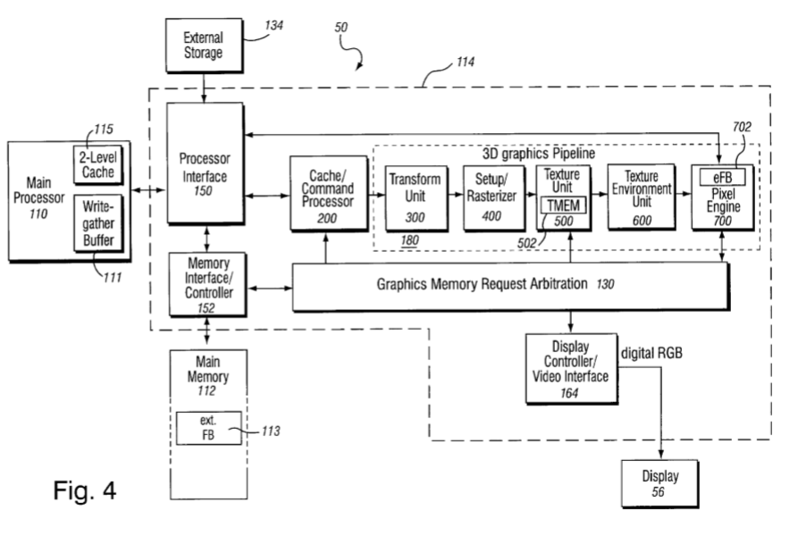
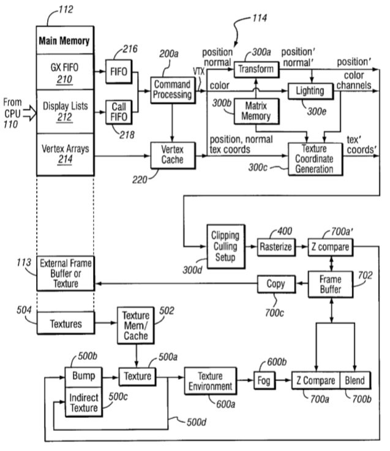
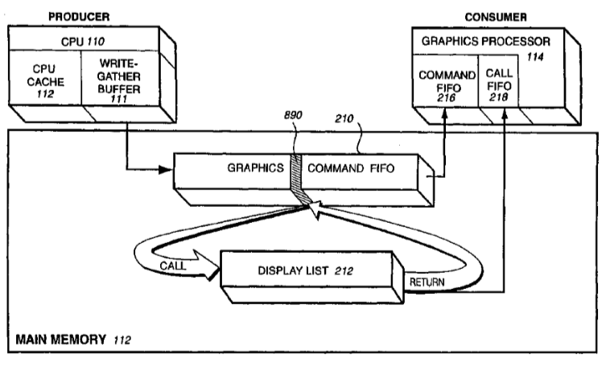
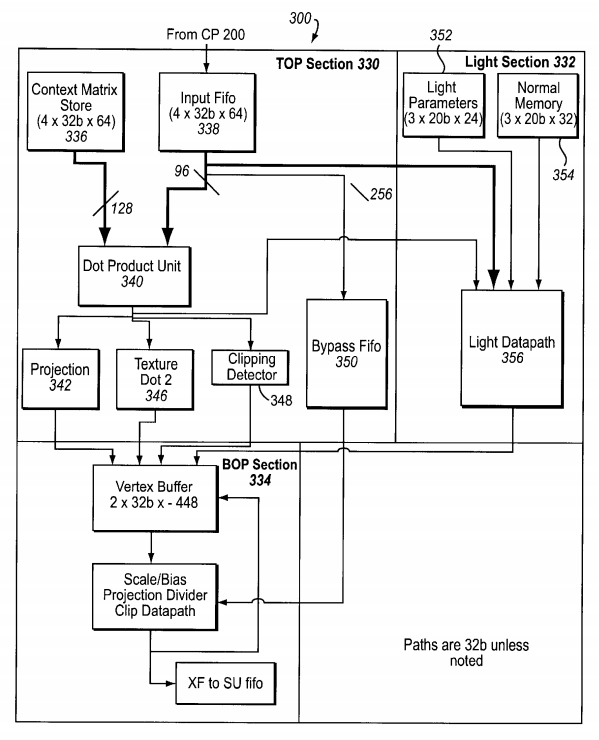
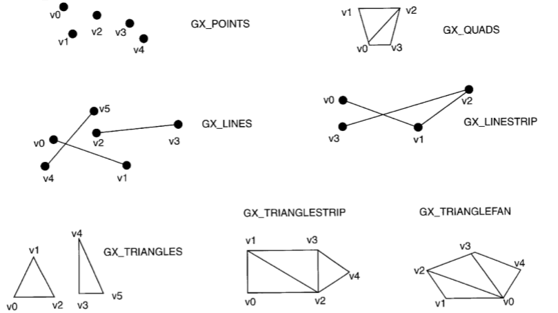

# Flipper GPU (GX)

Flipper GPU (hereinafter GX) is a graphics processor with a fixed pipeline. Although the GX is quite complex, it certainly does not compare with modern GPUs in terms of complexity.

But even in spite of the average complexity - the GX scheme is so confusing that it is quite difficult to compose a document with a clear presentation structure. The formalization of knowledge on GX becomes available only after reading the entire documentation.

GX connection with other Flipper components:



Internal GX architecture:



So that you can estimate the complexity of each GX component, here is a picture with the layout of the main areas of the Flipper chip:


Information in this document may be inaccurate and will be updated in the process.

## Gekko Write Gather Buffer

Generally speaking, this section is not specific to GX, but it is better to put it here for context.

Write Gather Buffer is a small FIFO inside the Gekko processor that collects single-beat writes at the specified physical address, and when 32 bytes are collected, it passes them to Flipper as a single burst transaction.

Write Gather Buffer can be configured to any physical address. But if it is configured to the address 0x0C008000 - the burst transaction is performed using the PI FIFO mechanism: Write to the PI FIFO physical address Wrptr performed, which is then increased to 32 and PI FIFO is checked for overflow (if Wrptr becomes equal to Endptr, it is initialized with the Top value and Wrap bit is set).

### Write Pipe Address Register (WPAR)

WPAR is mapped as Gekko SPR 921.

|Bits|Name|Meaning|
|----|----|-------|
|0-26|GB_ADDR|High order address bits of the data to be gathered. The low order address bits are zero, forcing the address to be cache line aligned. Note that only these 27 bits are compared to determine if a non-cacheable store will be gathered. If the address of the non-cacheable store has a non-zero value in the low order five bits, incorrect data will be gathered.|
|27-30|-|Reserved|
|31|BNE|Buffer not empty (read only)|

Write Gather Buffer is enabled by setting a bit in the Gekko HID2 register.

## GX FIFOs

There are two FIFOs: PI FIFO and CP FIFO. PI FIFO belongs to the Gekko processor and is accessible through PI registers. CP FIFO refers to the GX and is configured with its own CP registers.

Processor-GX interaction diagram using the FIFOs mechanism:



Call FIFO is processed separately and does not depend on PI/CP FIFOs.

## Processor Interface FIFO

PI FIFO is used to generate a command list. It acts as a producer.

### PI FIFO Registers

### PI FIFO Base (0x0C00300C)

|Bits|Name|Meaning|
|----|----|-------|
|31:26| |Reserved(?)|
|25:5|BASE|The value to write Wrptr after the PI FIFO overflow (when Wrptr becomes Top).|
|4:0|0|Zeroes|

### PI FIFO Top (0x0C003010)

|Bits|Name|Meaning|
|----|----|-------|
|31:26| |Reserved(?)|
|25:5|TOP|Monitors PI FIFO overflow. When Wrptr becomes Top, Wrptr is reset to Base.|
|4:0|0|Zeroes|

### PI FIFO Write Pointer (0x0C003014)

|Bits|Name|Meaning|
|----|----|-------|
|31:27| |Reserved(?)|
|26|WRAP|Set to `1` after Wrptr becomes equal to the value of Top. When is it reset? It looks like a subsequent write to FIFO automatically clears the bit.|
|25:5|WRPTR|The current address for writing the next 32 bytes of FIFO data. Writing is made when the processor performs a burst transaction at the address 0x0C008000. After write, the value is increased by 32. When the value becomes equal to Top, Wrptr is set to Base and the Wrap bit is set.|
|4:0|0|Zeroes|

As you can see, PI FIFO knows nothing about the mode in which it works: linked or multi-buffer. This logic is implemented entirely in the GX command processor.

## Command Processor/Vertex Cache

The command processor fetches:
- Command streams from main memory via an on-chip FIFO memory buffer that receives and buffers the graphics commands for synchronization/flow control and load balancing.
- Display lists from main memory via an on-chip call FIFO memory buffer.
- Vertex attributes from the command stream and/or from vertex arrays in memory via a vertex cache.

Reading FIFOs from the GX side are always set to 32 byte chunks.

### Command Processor FIFO

|Register Name|Bit Fields|Description|
|-------------|----------|-----------|
|CP_STATUS Register |0:|FIFO overflow (fifo_count > FIFO_HICNT)|
| 					|1:|FIFO underflow (fifo_count < FIFO_LOCNT)|
|					|2:|FIFO read unit idle|
| 					|3:|CP idle|
|                   |4:|FIFO reach break point (cleared by disable FIFO break point)|
|CP_ENABLE Register |0:|Enable FIFO reads, reset value is `0` disable|
|                   |1:|FIFO break point enable bit, reset value is `0` disable|
|                   |2:|FIFO overflow interrupt enable, reset value is `0` disable|
|                   |3:|FIFO underflow interrupt enable, reset value is `0` disable|
|                   |4:|FIFO write pointer increment enable, reset value is `1` enable|
|                   |5:|FIFO break point interrupt enable, reset value is `0` disable|
|CP_CLEAR Register|0:|clear FIFO overflow interrupt|
|                 |1:|clear FIFO underflow interrupt|
|CP_STM_LOW Register|7:0|bits 7:0 of the Streaming Buffer low water mark in 32 bytes increment, default (reset) value is `0x0000`|
|CP_FIFO_BASEL|15:5|bits 15:5 of the FIFO base address in memory|
|CP_FIFO_BASE|9:0|bits 25:16 of the FIFO base address in memory|
|CP_FIFO_TOPL|15:5|bits 15:5 of the FIFO top address in memory|
|CP_FIFO_TOPH|9:0|bits 25:16 of the FIFO top address in memory|
|CP_FIFO_HICNTL|15:5|bits 15:5 of the FIFO high water count|
|CP_FIFO_HICNTH|9:0|bits 25:16 of the FIFO high water count|
|CP_FIFO_LOCNTL|15:5|bits 15:5 of the FIFO low water count|
|CP_FIFO_LOCNTH|9:0|bits 25:16 of the FIFO low water count|
|CP_FIFO_COUNTL|15:5|bits 15:5 of the FIFO_COUNT (entries currently in FIFO)|
|CP_FIFO_COUNTH|9:0|bits 25:16 of the FIFO_COUNT (entries currently in FIFO)|
|CP_FIFO_WPTRL|15:5|bits 15:5 of the FIFO write pointer|
|CP_FIFO_WPTRH|9:0|bits 25:15 of the FIFO write pointer|
|CP_FIFO_RPTRL|15:5|bits 15:5 of the FIFO read pointer|
|CP_FIFO_RPTRH|9:0|bits 25:15 of the FIFO read pointer|
|CP_FIFO_BRKL|15:5|bits 15:5 of the FIFO read address break point|
|CP_FIFO_BRKH|9:0|bits 9:0 if the FIFO read address break point|

CP FIFO operates in two modes: linked mode and multi-buffer mode.

Linked mode is turned on by bit 4 in the CP_ENABLE register. In this mode, writing another portion of data to FIFO 0x0C008000 causes CP Wrptr to increase its value by 32. At the same time, writing to 0x0C008000 is processed by the PI FIFO mechanism (see above). This interaction causes the CP to start processing FIFOs whenever possible, as the distance between CP Rdptr and CP Wrptr has changed.

In Linked mode, Watermark logic is activated. If the FIFO size (FIFO_COUNT) becomes smaller than FIFO_LOCNT, a FIFO underflow is generated. If the FIFO size becomes larger than FIFO_HICNT, a FIFO overflow interrupt is generated. When underflow/overflow interrupts are active CP stops reading new data.

Breakpoint logic is mode-independent (?). When FIFO_RPTR becomes equal to FIFO_BRK, a Breakpoint interrupt is generated.

In multi-buffer mode, the CP processes FIFO until the FIFO size (FIFO_COUNT) is greater than 0. FIFO_COUNT is the distance between CP Wrptr and CP Rdptr.

### FIFO Command Format

|Opcode|Opcode(7:0)|Next|Followed by|
|------|-----------|----|-----------|
|NOP|00000000|none|none|
|Draw_Quads|10000vat(2:0)|VertexCount(15:0)|Vertex attribute stream|
|Draw_Triangles|10010vat(2:0)|VertexCount(15:0)|Vertex attribute stream|
|Draw_Triangle_strip|10011vat(2:0)|VertexCount(15:0)|Vertex attribute stream|
|Draw_Triangle_fan|10100vat(2:0)|VertexCount(15:0)|Vertex attribute stream|
|Draw_Lines|10101vat(2:0)|VertexCount(15:0)|Vertex attribute stream|
|Draw_Line_strip|10110vat(2:0)|VertexCount(15:0)|Vertex attribute stream|
|Draw_Points|10111vat(2:0)|VertexCount(15:0)|Vertex attribute stream|
|CP_LoadRegs (for CP only registers)|00001xxx|Address[7:0]|32 bits data|
|XF_LoadRegs (This is used for loading all XF registers, including matrices. It can be used to load matrices with immediate data)|00010xxx|none|(N+2)*32 bits. First 32 bit: 15:00 register address in XF; 19:16 number of 32 bit registers to be loaded (N+1, 0 means 1. 0xff means 16); 31:20 unused. Next N+1 32 bits: 31:00 register data|
|XF_IndexLoadRegA (registers are in the first 4K address space of the XF. It can be used to block load matrix and light registers)|00100xxx|none|32 bits. 11:0 register address in XF. 15:12 number of 32 bit data, (0 means 1, 0xff means 16). 31:16 Index to the register Array A|
|XF_IndexLoadRegB (registers are in the first 4K address space of the XF. It can be used to block load matrix and light registers)|00101xxx|none|32 bits. 11:0 register address in XF. 15:12 number of 32 bit data, (0 means 1, 0xff means 16). 31:16 Index to the register Array B|
|XF_IndexLoadRegC (registers are in the first 4K address space of the XF. It can be used to block load matrix and light resisters)|00110xxx|none|32 bits. 11:0 register address in XF. 15:12 number of 32 bit data, (0 means 1, 0xff means 16). 31:16 Index to the register Array C|
|XF_IndexLoadRegD (registers are in the first 4K address space of the XF. It can be used to block load matrix and light registers)|00111xxx|none|32 bits. 11:0 register address in XF. 15:12 number of 32 bit data, (0 means 1, 0xff means 16). 31:16 Index to the register Array D|
|Call_Object|01000xxx|none|2x32. 25:5 address (need to be 32 byte align). 25:5 count (32 byte count). Call FIFO cannot be nested.|
|V$\_Invalidate|01001xxx|none|none|
|SU_ByPassCmd (This includes all the register load below XF and all setup unit commands, which bypass XF)|0110,SUattr(3:0)|none|32 bit data|

### Vertex Cache

Vertex cache is used to cache those attributes of graphic primitives that are not obtained from the command list, but indexed from the main memory.

The vertex cache is an 8K, 8-way set-associative cache. It is possible to invalidate the cache with a special command from the command list (V$\_Invalidate).

More description can be found in US6717577 "VERTEX CACHE FOR 3D COMPUTER GRAPHICS".

### Internal State Registers

GX state stored in 3 sets of registers:
- CP Registers
- XF Registers
- So-called "ByPass" (BP) address space Registers. They are called ByPass, because they are accessed bypassing the vertex transformation unit (XF)

Writing to registers is performed by special FIFO commands. Partially CP registers are mapped to CPU physical memory.

### CP Registers

|Register name|Register address [7:0]|Bit fields|
|---|---|---|
|MatrixIndexA	|0011xxxx|5:0 index for position/normal matrix|
| 				|		 |11:6 index for tex0 matrix|
| 				|		 |17:12 index for tex1 matrix|
| 				|		 |23:18 index for tex2 matrix|
| 				|		 |29:24 index for tex3 matrix|
|MatrixIndexB	|0100xxxx|5:0 index for tex4 matrix|
|				|		 |11:6 index for tex5 matrix|
|				|		 |17:12 index for tex6 matrix|
|				|		 |23:18 index for tex7 matrix|
|VCD_Lo 		|0101xxxx|16:00 VCD 12 to 0|
|				|		 |0 PosNrmMatIdx|
|				|		 |1 Tex0MatIdx|
|				|		 |2 Tex1MatIdx|
|				|		 |3 Tex2MatIdx|
|				|		 |4 Tex3MatIdx|
|				|		 |5 Tex4MatIdx|
|				|		 |6 Tex5MatIdx|
|				|		 |7 Tex6MatIdx|
|				|		 |8 Tex7MatIdx|
|				|		 |10:9 Position|
|				|		 |12:11 Normal|
|				|		 |14:13 ColorDiffused (Color0)|
|				|		 |16:15 ColorSpecular (Color1)|
|VCD_Hi			|0110xxxx|15:00 VCD 20 to 13|
|				|		 |01:00 Tex0Coord|
|				|		 |03:02 Tex1Coord|
|				|		 |05:04 Tex2Coord|
|				|		 |07:06 Tex3Coord|
|				|		 |09:08 Tex4Coord|
|				|		 |11:10 Tex5Coord|
|				|		 |13:12 Tex6Coord|
|				|		 |15:14 Tex7Coord|
|VAT_group0 	|0111x,vat[2:0]	|32 bits|
|				|				|08:00 Position parameters|
|				|				|12:09 Normal parameters|
|				|				|16:13 ColorDiffused parameters|
|				|				|20:17 ColorSpecular parameters|
|				|				|29:21 Tex0Coord parameters|
|				|				|30:30 ByteDequant (must always be 1)|
|				|				|31:31 Normalindex3|
|VAT_group1		|1000x,vat[2:0]	|32 bits|
|				|				|08:00 Tex1Coord parameters|
|				|				|17:09 Tex2Coord parameters|
|				|				|26:18 Tex3Coord parameters|
|				|				|30:27 Tex4Coord parameters sub-field[3:0]|
|				|				|31 VcacheEnhance (must always be 1)|
|VAT_group2		|1001x,vat[2:0]	|32 bits|
|				|				|04:00 Tex4Coord parameters sub-field[8:4]|
|				|				|13:05 Tex5Coord parameters|
|				|				|22:14 Tex6Coord parameters|
|				|				|31:23 Tex7Coord parameters|
|ArrayBase		|1010,array[3:0]	|32 bit data|
|				|					|25:00 Base(25:0)|
|				|					|31:26 unused|
|ArrayStride 	|1011,array[3:0]	|32 bit data|
|				|					|07:00 Stride(7:0)|
|				|					|31:08 unused|

Values for array[3:0] for ArrayBase and ArrayStride:

|array[3:0] value|ArrayBase/ArrayStride register name|
|---|---|
|0000|atrributes9 base/stride register|
|0001|atrributes10 base/stride register|
|0010|atrributes11 base/stride register|
|0011|atrributes12 base/stride register|
|0100|atrributes13 base/stride register|
|0101|atrributes14 base/stride register|
|0110|atrributes15 base/stride register|
|0111|atrributes16 base/stride register|
|1000|atrributes17 base/stride register|
|1001|atrributes18 base/stride register|
|1010|atrributes19 base/stride register|
|1011|atrributes20 base/stride register|
|1100|IndexRegA base/stride register|
|1101|IndexRegB base/stride register|
|1110|IndexRegC base/stride register|
|1111|IndexRegD base/stride register|

For indexed attributes, the indexed attribute address is calculated as follows:

```
MemoryAddress=ArrayBase[I] + index * ArrayStride[I]
```

Vertex Command Descriptor (VCD) settings:

|Attribute number|Attribute name|bits|Encoding|
|---|---|---|---|
|0|PosMatIdx|0|Position/normal matrix index. Always direct if present. 0: not present 1: present. NOTE: position and normal matrices are stored in 2 separate RAMs in the Xform unit, but there is a one to one correspondence between normal and position index. If index "A" is used for the position, then index "A" needs to be used for the normal as well.|
|1|Tex0MatIdx|1|TextCoord0 matrix index, always direct if present. 0: not present 1: present|
|2|Tex1MatIdx|2|TextCoord1 matrix index, always direct if present. 0: not present 1: present|
|3|Tex2MatIdx|3|TextCoord2 matrix index, always direct if present. 0: not present 1: present|
|4|Tex3MatIdx|4|TextCoord3 matrix index, always direct if present. 0: not present 1: present|
|5|Tex4MatIdx|5|TextCoord4 matrix index, always direct if present. 0: not present 1: present|
|6|Tex5MatIdx|6|TextCoord5 matrix index, always direct if present. 0: not present 1: present|
|7|Tex6MatIdx|7|TextCoord6 matrix index, always direct if present. 0: not present 1: present|
|8|Tex7MatIdx|8|TextCoord7 matrix index, always direct if present. 0: not present 1: present|
|9|Position|10:9|00: reserved, 01: direct, 10: 8 bit index, 11: 16 bit index|
|10|Normal|12:11|00: not present, 01: direct, 10: 8 bit index, 11: 16 bit index|
|11|Color0|14:13|00: not present, 01: direct, 10: 8 bit index, 11: 16 bit index|
|12|Color1|16:15|00: not present, 01: direct, 10: 8 bit index, 11: 16 bit index|
|13|Tex0Coord|18:17|00: not present, 01: direct, 10: 8 bit index, 11: 16 bit index|
|14|Tex1Coord|20:19|00: not present, 01: direct, 10: 8 bit index, 11: 16 bit index|
|15|Tex2Coord|22:21|00: not present, 01: direct, 10: 8 bit index, 11: 16 bit index|
|16|Tex3Coord|24:23|00: not present, 01: direct, 10: 8 bit index, 11: 16 bit index|
|17|Tex4Coord|26:25|00: not present, 01: direct, 10: 8 bit index, 11: 16 bit index|
|18|Tex5Coord|28:27|00: not present, 01: direct, 10: 8 bit index, 11: 16 bit index|
|19|Tex6Coord|30:29|00: not present, 01: direct, 10: 8 bit index, 11: 16 bit index|
|20|Tex7Coord|32:31|00: not present, 01: direct, 10: 8 bit index, 11: 16 bit index|

If the index is 0xFF for 8-bit indexes or 0xFFFF for 16-bit indexes, then the vertex with that index is skipped.

Vertex Attribute Table (VAT) settings:

|Bit field|Attribute number|Attribute name|.CompCount sub-field(0)|.CompSize sub-field(3:1)|.Shift amount sub-field(8:4)|
|---|---|---|---|---|---|
|8:0|9|Position|0: two (x,y), 1: three (x,y,z)|0:ubyte, 1:byte, 2:ushort, 3:short, 4:float, 5-7: reserved|Location of decimal point from LSB. This shift applies to all u/short components and to u/byte components where ByteDequant is asserted (Below).|
|12:9|10|Normal|0: three normals, 1: nine normals|0:reserved, 1:byte, 2:reserved, 3:short, 4:float, 5-7: reserved|NA (Byte: 6, Short: 14)|
|16:13|11|Color0|0: three (r,g,b), 1: four (r,g,b,a)|0: 16 bit 565 (three comp), 1: 24 bit 888 (three comp), 2: 32 bit 888x (three comp), 3: 16 bit 4444 (four comp), 4: 24 bit 6666 (four comp), 5: 32 bit 8888 (four comp)|NA|
|20:17|12|Color1|0: three (r,g,b), 1: four (r,g,b,a)|0: 16 bit 565 (three comp), 1: 24 bit 888 (three comp), 2: 32 bit 888x (three comp), 3: 16 bit 4444 (four comp), 4: 24 bit 6666 (four comp), 5: 32 bit 8888 (four comp)|NA|
|29:21|13|Tex0Coord|0: one (s), 1: two (s,t)|0:ubyte, 1:byte, 2:ushort, 3:short, 4:float, 5-7: reserved|Location of decimal point from LSB (ByteDequant, see below)|
|38:30|14|Tex1Coord|0: one (s), 1: two (s,t)|0:ubyte, 1:byte, 2:ushort, 3:short, 4:float, 5-7: reserved|Location of decimal point from LSB (ByteDequant, see below)|
|47:39|15|Tex2Coord|0: one (s), 1: two (s,t)|0:ubyte, 1:byte, 2:ushort, 3:short, 4:float, 5-7: reserved|Location of decimal point from LSB (ByteDequant, see below)|
|56:48|16|Tex3Coord|0: one (s), 1: two (s,t)|0:ubyte, 1:byte, 2:ushort, 3:short, 4:float, 5-7: reserved|Location of decimal point from LSB (ByteDequant, see below)|
|65:57|17|Tex4Coord|0: one (s), 1: two (s,t)|0:ubyte, 1:byte, 2:ushort, 3:short, 4:float, 5-7: reserved|Location of decimal point from LSB (ByteDequant, see below)|
|74.66|18|Tex5Coord|0: one (s), 1: two (s,t)|0:ubyte, 1:byte, 2:ushort, 3:short, 4:float, 5-7: reserved|Location of decimal point from LSB (ByteDequant, see below)|
|83:75|19|Tex6Coord|0: one (s), 1: two (s,t)|0:ubyte, 1:byte, 2:ushort, 3:short, 4:float, 5-7: reserved|Location of decimal point from LSB (ByteDequant, see below)|
|92:84|20|Tex7Coord|0: one (s), 1: two (s,t)|0:ubyte, 1:byte, 2:ushort, 3:short, 4:float, 5-7: reserved|Location of decimal point from LSB (ByteDequant, see below)|
|93:93|FLAG|ByteDequant|(Rev B Only)|0: Shift does not apply to u/byte and u/short, 1: Shift does apply to u/byte and u/short|Shift applies for u/byte and u/short components of position and texture attributes.|
|94:94|FLAG|Normal Index3|(Rev B Only)|0: Single index per Normal, 1: Triple index per nine Normal|When nine normals selected in indirect mode, input will be treated as three staggered indices (one per triple biased by component size), into normal table. NOTE! First index internally biased by 0. Second index internally biased by 1. Third index internally biased by 2.|

## Transform Unit (XF)

Transform unit performs a variety of 2D and 3D transform and other operations:
- transforms incoming geometry per vertex from object space to Screen Space
- transforms incoming texture coordinates and computes projective texture coordinates
- perform lighting processing providing per vertex lighting computations for up to eight independent lights
- perform texture coordinate generation for embossed type bump mapping effects
- polygon clipping/culling operations

Transform unit has 3 matrix memories for storing matrices used in transformation processing:
- ModelView/Texture matrix memory, organized in a 64 entry by four 32b words
- Normal matrix memory, organized as 32 rows of 3 words
- Texture post-transform matrix memory, organized in a 64 entry by four 32b words

XF also contains memory for storing parameters of 8 lights (organized in 8 records of 16 words), and also has a number of registers to control the transformation process.

XF block diagram:



### XF Registers

|Register Address|Definition|Configuration|
|---|---|---|
|0x0000|ModelView/Texture Matrix Ram word 0|32b matrix data|
|0x0001-0x00ff|ModelView/Texture Matrix Ram word (n)|32b matrix data|
|0x0100-0x03ff|Not used| |
|0x0400-0x402|Normal Ram words 0,1,2|20b data|
|0x0403-0x045f|Normal Ram word (n)|20b data|
|0x0460-0x04ff|Not used| |
|0x0500|Dual-texture transform Matrix Ram word 0|32b matrix data|
|0x0501-0x05ff|Dual-texture transform Matrix Ram word (n)|32b matrix data|
|0x0600|Reserved| |
|0x0601|Reserved| |
|0x0602|Reserved| |
|0x0603|Light0|32b: RGBA (8b/comp)|
|0x0604|Light0A0|20b: cos atten. A0|
|0x0605|Light0A1|20b: cos atten. A1|
|0x0606|Light0A2|20b: cos atten. A2|
|0x0607|Light0K0|20b: dist atten. K0|
|0x0608|Light0K1|20b: dist atten. K1|
|0x0609|Light0K2|20b: dist atten. K2|
|0x060a|Light0Lpx|20b: x light pos, or inf ldir x|
|0x060b|Light0Lpy|20b: y light pos, or inf ldir y|
|0x060c|Light0Lpz|20b: z light pos, or inf ldir z|
|0x060d|Light0Dx/Hx|20b: light dir x, or 1/2 angle x|
|0x060e|Light0Dy/Hy|20b: light dir y, or 1/2 angle y|
|0x060f|Light0Dz/Hz|20b: light dir z, or 1/2 angle z|
|0x0610-0x067f|Light(n) data|Parameters for Light1-Light7. See Light0 data|
|0x0680-0x07ff|Not used|Reserved|
|0x1000|Error| |
|0x1001|Diagnostics| |
|0x1002|State0|Internal state register0|
|0x1003|State1|Internal state register1|
|0x1004|Xf_clock|Enables power saving mode. 0: No power saving when idle, 1: Enable power saving when idle|
|0x1005|ClipDisable|Disables some or all of clipping. B[0]: When set, disables clipping detection (0 default), B[1]: When set, disables trivial rejection (0 default), B[2]: When set, disables cpoly clipping acceleration (0 default)|
|0x1006|Perf0|Performance monitor selects|
|0x1007|Perf1|Xform target performance register: [6:0]: Xform internal target performance (Cycles/vertex)|
|0x1008|InVertexSpec|B[1:0]: Specifies host supplied color0 usage: 0: No host supplied color information 1: Host supplied color0 2: Host supplied color0 and color1; B[3:2]: Specifies host supplied normal: 0: No host supplied normal 1: Host supplied normal 2: Host supplied normal and binormals; B[7:4]: Specifies # of host supplied texture coordinates 0: No host supplied textures 1: 1 host supplied texture pair (S0, T0) 2-8: 2-8 host supplied texturepairs; 9-15: Reserved|
|0x1009|NumColors|Specifies the number of colors to output: 0: No xform colors active, 1: Xform supplies 1 color (host supplied or computed), 2: Xform supplies 2 colors (host supplied or computed)|
|0x100a|Ambient0|32b: RGBA (8b/comp) Ambient color0 specifications|
|0x100b|Ambient1|32b: RGBA (8b/comp) Ambient color1 specifications|
|0x100c|Material0|32b: RGBA (8b/comp) global color0 material specifications|
|0x100d|Material1|32b: RGBF (8b/comp) global color1 material specifications|
|0x100e|Color0Cntrl|B[0]: Color0 Material source 0: Use register (Material 0), 1: Use CP supplied Vertex color 0; B[1]: Color0 LightFunc 0: Use 1.0, 1: Use Illum0; B[2]: Light0 is source 0: Do not use light, 1: Use light; B[3]: Light1 is source 0: Do not use light, 1: Use light; B[4]: Light2 is source 0: Do not use light, 1: Use light; B[5]: Light3 is source 0: Do not use light, 1: Use light; B[6]: Ambient source 0: Use register Ambient0 register, 1: Use CP supplied vertex color 0; B[8:7]: DiffuseAtten function 0: Select 1.0, 1: Select N.L signed, 2: Select N.L clamped to [0,1.0]; B[9]: AttenEnable function 0: Select 1.0, 1: Select Attenuation fraction; B[10]: AttenSelect function 0: Select specular (N.H) attenuation, 1: Select diffuse spotlight (L.Ldir) attenuation; B[11]: Light4 is source 0: Do not use Light, 1: Use light; B[12]: Light 5 is source 0: Do not use Light, 1: Use light; B[13]: Light 6 is source 0: Do not use, Light 1: Use light; B[14]: Light 7 is source 0: Do not use Light, 1: Use light|
|0x100f|Color1Cntrl|B[0]: Color Material source 0: Use register (Material 1) 1: Use CP supplied Vertex color 1; B[1]: Color1 LightFunc 0: Use 1.0 1: Use Illum1; B[2]: Light0 is source 0: Do not use light 1: Use light; B[3]: Light1 is source 0: Do not use light 1: Use light; B[4]: Light2 is source 0: Do not use light 1: Use light; B[5]: Light3 is source 0: Do not use light 1: Use light; B[6]: Ambient source 0: Use register Ambient1 register 1: Use CP supplied vertex color 1; B[8,7]: DiffuseAtten function 0: Select 1.0 1: Select N.L, signed 2: Select N.L clamped to [0,1.0]; B[9]: AttenEnable function 0: Select 1.0 1: Select Attenuation fraction; B[10]: AttenSelect function 0: Select specular (N.H) attenuation 1: Select diffuse spotlight (L.Ldir) attenuation; B[11]: Light4 is source 0: Do not use Light 1: Use light; B[12]: Light 5 is source 0: Do not use light 1: Use light; B[13]: Light 6 is source 0: Do not use light 1: Use light; B[14]: Light7 is source 0: Do not use light 1: Use light|
|0x1010|Alpha0Cntrl|B[0]: Color0 alpha Material source 0: Use register (Material 0 alpha) 1: Use CP supplied Vertex color 0 alpha; B[1]: Color0 alpha Light Func 0: Use 1.0 1: Use Illum0; B[2]: Light0 alpha is source 0: Do not use light 1: Use light; B[3]: Light1 alpha is source 0: Do not use light 1: Use light; B[4]: Light2 alpha is source 0: Do not use light 1: Use light; B[5]: Light 3 alpha is source 0: Do not use light 1: Use light; B[6]: Ambient source 0: Use register Ambient0 alpha register 1: Use CP supplied vertex color 0 alpha; B[8:7]: DiffuseAtten function 0: Select 1.0 1: Select N.L, signed 2: Select N.L clamped to [0,1.0]; B[9]: AttenEnable function 0: Select 1.0 1: Select Attenuation fraction; B[10]: AttenSelect function 0: Select specular (N.H) attenuation 1: Select diffuse spotlight (L.Ldir) attenuation; B[11]: Light4 is source 0: Do not use Light 1:Use light; B[12]: Light 5 is source 0: Do not use Light 1: Use Light; B[13]: Light 6 is source 0: Do not use Light 1: Use light; B[14]: Light 7 is source 0: Do not use Light 1: Use light|
|0x1011|Alpha1Cntrl|B[0]: Color1 alpha Material source 0: Use CP supplied Vertex color 1 alpha; B[1]: Color1 alpha LightFunc 0: Use 1.0 1: Use Illum0; B[2]: Light0 alpha is source 0: Do not use light 1: Use light; B[3]: Light1 alpha is source 0: Do not use light 1: Use light; B[4]: Light2 alpha is source 0: Do not use light 1: Use light; B[5]: Light3 alpha is source 0: Do not use light 1: Use light; B[6]: Ambient source 0: Use register Ambient1 alpha register 1: Use CP supplied vertex color 1 alpha; B[8:7]: DiffuseAtten function 0: Select 1.0 1: Select N.L, signed 2: Select N.L clamped to [0,2.0]; B[9]: AttenEnable function 0: Select 1.0 1: Se]ect Attenuation fraction; B[10]: AttenSelect function 0: Select specular (N.H) attenuation 1: Select diffuse spotlight (L.Ldir) attenuation; B[11]: Light 4 is source 0: Do not use Light 1: Use light; B[12]: Light 5 is source 0: Do not use Light 1: Use light; B[13]: Light 6 is source 0: Do not use Light 1: Use light; B[14]: Light 7 is source 0: Do not use Light 1: Use light|
|0x1012|DualTexTran|B[0]: When set(1), enables dual transform for all texture coordinates. When reset (0), disables dual texture transform feature [rev B]|
|0x1018|MatrixIndex0|B[5:0]: Geometry matrix index; B[11:6]: Tex0 matrix index; B[17:12]: Tex1 matrix index; B[23:18]: Tex2 matrix index; B[29:24]: Tex3 matrix index|
|0x1019|MatrixIndex1|B[5:0]: Tex4 matrix index; B[11:6]: Tex5 matrix index; B[17:12]: Tex6 matrix index; B[23:18]: Tex7 matrix index|
|0x101a|ScaleX|Viewport scale X|
|0x101b|ScaleY|Viewport scale Y|
|0x101c|ScaleZ|Viewport scale Z|
|0x101d|OffsetX|Viewport offset X|
|0x101e|OffsetY|Viewport offset Y|
|0x101f|OffsetZ|Viewport offset Z|
|0x1020|ProjectionA|A parameter in projection equations|
|0x1021|ProjectionB|B parameter in projection equations|
|0x1022|ProjectionC|C parameter in projection equations|
|0x1023|ProjectionD|D parameter in projection equations|
|0x1024|ProjectionE|E parameter in projection equations|
|0x1025|ProjectionF|F parameter in projection equations|
|0x1026|ProjectOrtho|If set selects orthographic otherwise non-orthographic (Zh or 1.0 select)|
|0x103f|NumTex|Number of active textures|
|0x1040|Tex0|B0: Reserved; B1: texture projection 0: (s,t): texmul is 2x4 1: (s,t,q): texmul is 3x4; B2: input form (format of source input data for regular textures) 0: (A, B, 1.0, 1.0) (used for regular texture source) 1: (A, B, C, 1.0) (used for geometry or normal source); B[3]: Reserved; B[6,4]: texgen type 0: Regular transformation (transform incoming data), 1: texgen bump mapping, 2: Color texgen: (s,t)=(r,g:b) (g and b are concatenated), color0, 3: Color texgen: (s,t)=(r,g:b) (g and b are concatenated), color 1; B[11:7]: regular texture source row: Specifies location of incoming textures in vertex (row specific) (i.e.: geometry is row0, normal is row1, etc . . .) for regular transformations (refer to the table below); B[14:12]: bump mapping source texture: n: use regular transformed tex(n) for bump mapping source; B[17:15]: Bump mapping source light: n: use light #n for bump map direction source (10 to 17)|
|0x1041|Tex1|See Tex0|
|0x1042|Tex2|See Tex0|
|0x1043|Tex3|See Tex0|
|0x1044|Tex4|See Tex0|
|0x1045|Tex5|See Tex0|
|0x1046|Tex6|See Tex0|
|0x1047|Tex7|See Tex0|
|0x1050|DualTex0|B[5:0]: Indicates which is the base row of the dual transform matrix for regular texture coordinate0. [Rev B]; B[7:6]: Not used; B[8]: specifies if texture coordinate should be normalized before send transform.|
|0x1051|DualTex1|See DualTex0|
|0x1052|DualTex2|See DualTex0|
|0x1053|DualTex3|See DualTex0|
|0x1054|DualTex4|See DualTex0|
|0x1055|DualTex5|See DualTex0|
|0x1056|DualTex6|See DualTex0|
|0x1057|DualTex7|See DualTex0|

## Setup/Rasterizers (SU/RAS)

Setup unit receives vertex data from transform unit (XF) and sends triangle setup information to one or more rasterizer units performing edge rasterization, texture coordinate rasterization and color rasterization.

Terminology:
- The primitive is what the GX can draw. Triangle, point, etc.
- Primitives consist of vertices;
- Each vertex contains a set of attributes (position, color etc.). At least position attribute must be present;
- Attributes can be Direct and Indexed. Direct attributes are contained in the command list itself. For indexed attributes, the command list contains only the index. A buffer with attributes is located in the main memory and is additionally cached in Vertex cache.

The rasterizer(s) is able to draw the following graphic primitives:



The GX contains three rasterizers RAS0, RAS1 and RAS2.

## Texture Environment Unit (TEV)

TBD.

## Texture Unit

TBD.

## Texture Cache (TMEM)

TBD.

## Pixel Engine

### Embedded Frame Buffer (EFB)

TBD.

### Color/Z Compare (C/Z)

TBD.

### Pixel Engine Copy (PEC)

TBD.

### PE Registers

## GP Metrics

TBD.

## BP Address Space Registers

TBD.
