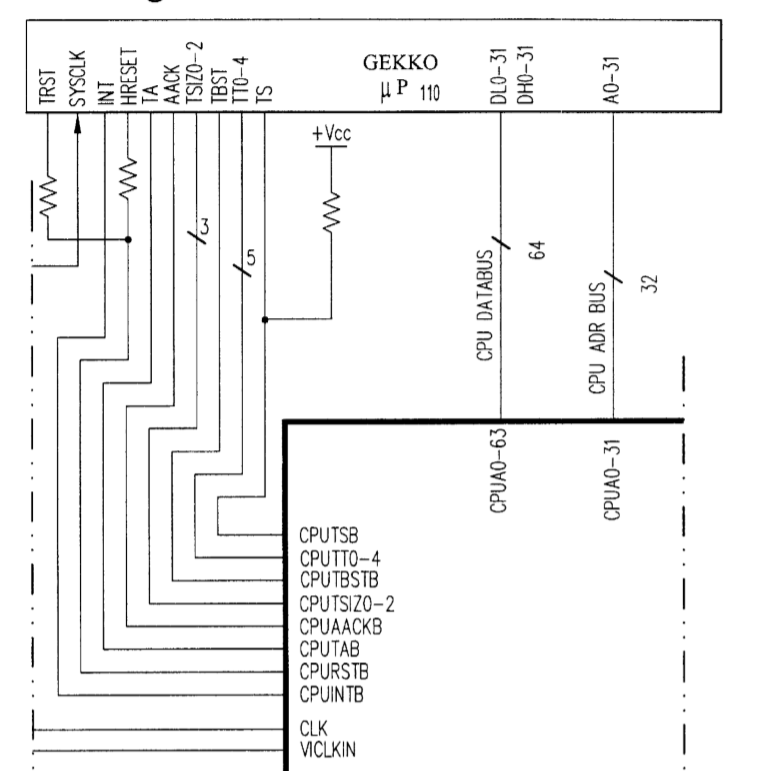

# Flipper Processor Interface (PI)

This section describes the interface between the Gekko CPU and ASIC Flipper.

Information obtained from US Pat. No. 6,609,977 and Gekko User's Manual.

Gekko-Flipper interface is shown in the picture:

Signals description:

|Signal/group|Description|Direction|
|---|---|---|
|TRST|Must be also asserted in conjunction with HRESET|From Flipper|
|HRESET|Hardware Reset. Execution continues from 0xFFF0_0100 address|From Flipper|
|SYSCLK|486 Mhz Clock|To Gekko|
|INT|Interrupt request|From Flipper|
|TA|Transfer Acknowledge|From Flipper|
|AACK|Address Acknowledge (adress bus is latched by other side)|From Flipper|
|TSIZ0-2|Transfer Size (see below)|Set by Gekko|
|TBST|Transfer Burst. Additionaly used to send 32 Bytes|Set by Gekko|
|TT0-4|Transfer Type (see below)|Set by Gekko|
|TS|Transfer Start. Output: see TT0-4.|Set by Gekko|
|DL/DH0-31|64-bit Data Bus|Inout|
|A0-31|32-bit Address Bus|To Flipper|

### Transfer Size

The most important values:
- 2: Burst (32 Bytes)
- 0: 8 Bytes
- 1: 1 Byte
- 2: 2 Bytes
- 4: 4 Bytes

There is evidence and suspicion that for accessing the main memory, Flipper supports only 32-bit transactions and Burst (32 Bytes). Well, in fact, the remaining sizes are not so important for main memory, because interaction with the main memory occurs mainly through the cache (Burst operations).

### Transfer Type

Generally speaking, it’s not particularly interesting, since it is used for global synchronization between several cores and cache coherency. In fact, for the Gekko-Flipper bundle, only Single-beat read/write and Burst read/write are important.

## Conclusions

The operations performed on this interface are as follows:
- Memory Read / write (1, 2, 4, 8 and 32 bytes)
- Interrupt from Flipper (INT)
- Reset signal from Flipper

Burst transactions are used for the following purposes:
- Cache Fill
- Transfer to Flipper contents of Write-Gather Buffer

## PI Registers (Offset)

Mapped at 0x0C003000 physical address. 32-bit access.

### INTSR (0x0000)

|Bit Mask|Name|Meaning|
|---|---|---|
|0x00000001|PIINT| |
|0x00000002|RSWINT| |
|0x00000004|DIINT| |
|0x00000008|SIINT| |
|0x00000010|EXINT| |
|0x00000020|AIINT| |
|0x00000040|DSPINT| |
|0x00000080|MEMINT| |
|0x00000100|VIINT| |
|0x00000200|PEINT0| |
|0x00000400|PEINT1| |
|0x00000800|CPINT| |
|0x00001000|DBGINT| |
|0x00002000|SDINT| |
|0x0000c000|Unused| |
|0x00010000|RSTVAL| |
|0xfffe0000|Unused| |

### INTMSK (0x0004)

|Bit Mask|Name|Meaning|
|---|---|---|
|0x00000001|PIINT| |
|0x00000002|RSWMSK| |
|0x00000004|DIMSK| |
|0x00000008|SIMSK| |
|0x00000010|EXMSK| |
|0x00000020|AIMSK| |
|0x00000040|DSPMSK| |
|0x00000080|MEMMSK| |
|0x00000100|VIMSK| |
|0x00000200|PEMSK0| |
|0x00000400|PEMSK1| |
|0x00000800|CPMSK| |
|0x00001000|DBGMSK| |
|0x00002000|SDMSK| |
|0xffffc000|Unused| |

### PIESR (0x001C)

|Bit Mask|Name|Meaning|
|---|---|---|
|0x00000007|PIESR| |
|0xfffffff8|Unused| |

### PIEAR (0x0020)

|Bit Mask|Name|Meaning|
|---|---|---|
|0xffffffff|PIEAR| |

### CONFIG (0x0024)

|Bit Mask|Name|Meaning|
|---|---|---|
|0x00000001|SYSRSTB| |
|0x00000002|MEMRSTB| |
|0x00000004|DIRSTB| |
|0xfffffff8|PICFG| |

### DURAR (0x0028)

|Bit Mask|Name|Meaning|
|---|---|---|
|0x000003ff|PIRDR| |
|0xfffffc00|Unused| |

### CHIPID (0x002C)

This register contains information about the revision of the Flipper chip.

### STRGTH (0x0030)

A number of Flipper interfaces have customizable drive strength. The value of this register is set immediately after the reset in the Reset vector (stage BS1). In theory, you can burn Flipper if you set high values and use it for a long time..

|Bit Mask|Name|Meaning|
|---|---|---|
|0x00000007|AI_STR| |
|0x00000038|AIS_STR| |
|0x000001c0|SI_STR| |
|0x00000e00|EXI2_STR| |
|0x00007000|EXI1_STR| |
|0x00038000|EXI0_STR| |
|0x001c0000|DI_STR| |
|0x00e00000|VI_STR| |

### CPUDBB (0x0034)

|Bit Mask|Name|Meaning|
|---|---|---|
|0x00000001|DBB| |
|0xfffffffe|Unused| |

### PI CP FIFO Registers

### PI FIFO Base (CPBAS, 0x000C)

|Bits|Name|Meaning|
|----|----|-------|
|31:27| |Reserved(?)|
|26:5|BASE|The value to write Wrptr after the PI FIFO overflow (when Wrptr becomes Top).|
|4:0|0|Zeroes|

### PI FIFO Top (CPTOP, 0x0010)

|Bits|Name|Meaning|
|----|----|-------|
|31:27| |Reserved(?)|
|26:5|TOP|Monitors PI FIFO overflow. When Wrptr becomes Top, Wrptr is reset to Base.|
|4:0|0|Zeroes|

### PI FIFO Write Pointer (CPWRT, 0x0014)

|Bits|Name|Meaning|
|----|----|-------|
|31:28| |Reserved(?)|
|27|WRAP|Set to `1` after Wrptr becomes equal to the value of Top. When is it reset?|
|26:5|WRPTR|The current address for writing the next 32 bytes of FIFO data. Writing is made when the processor performs a burst transaction at the address 0x0C008000. After write, the value is increased by 32. When the value becomes equal to Top, Wrptr is set to Base and the Wrap bit is set.|
|4:0|0|Zeroes|

### PI FIFO Abort (CPABT, 0x0018)

|Bit Mask|Name|Meaning|
|---|---|---|
|0x00000001|CPABT| |
|0xfffffffe|Unused| |
