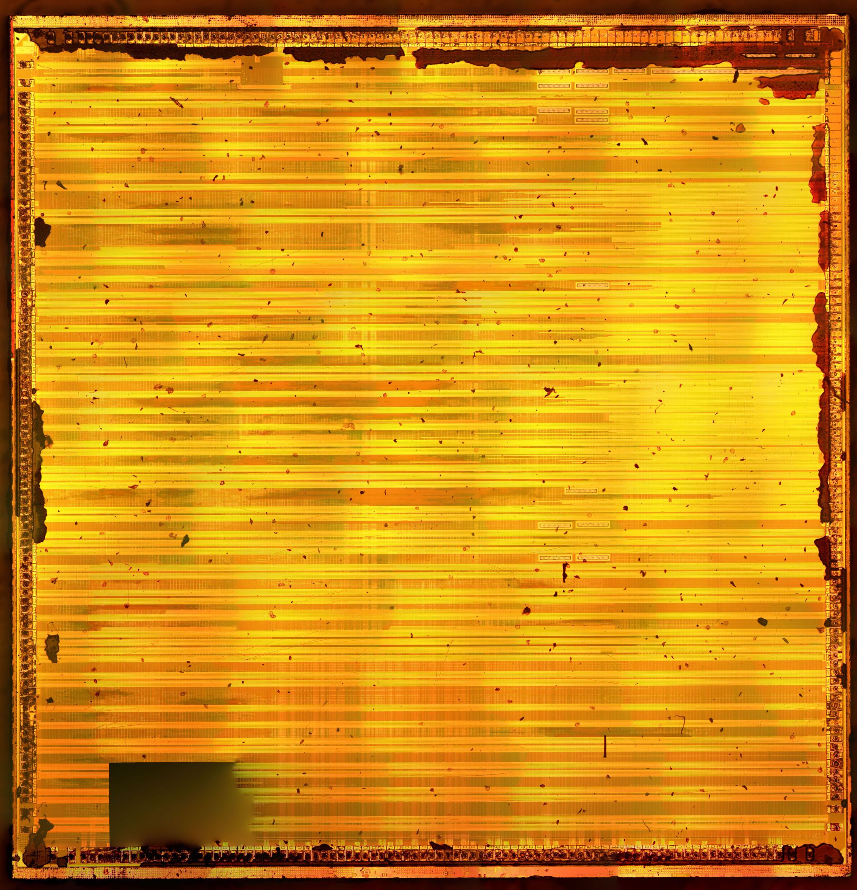
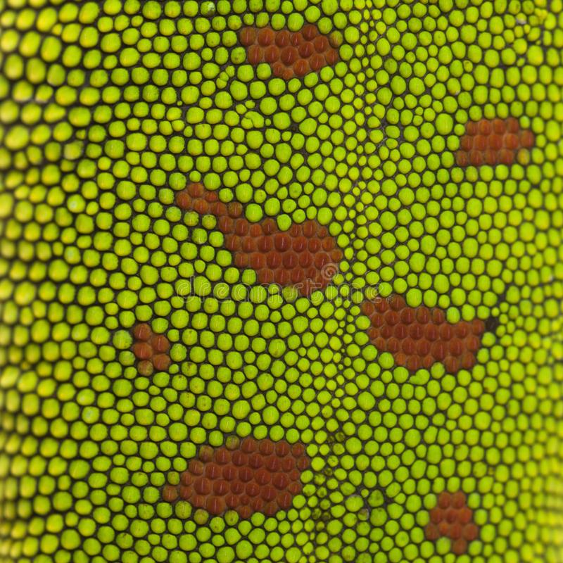

# Gekko Images

Some images of the Gekko processor from my microscope.

Full processor image compiled in Hugin, 10x magnification. Can be used to estimate the complexity of chip topology and pinout. During the stitcthing, Hugin did not cope with the photogrammetry in the lower left corner. I will update the picture later, as I make the stitching without errors.

Btw, the appearance of the processor topology differs from the pictures that circulate on the internet.

## Noticible features

The technology of wiring is shown. IBM uses a very unusual way - the bends of the wires occur with smooth transitions (cascades). In addition, the unused portion of the top layer of metal is mostly covered with circular patterns.

Of any markings, only one was found in the upper left corner. The inscriptions "IBM (C) 2000" and some other magic abbreviations (MQE, VQE, VLE, LMD). Perhaps a little higher there is another inscription, but it is hidden behind a layer of dirt (this is part of the microcircuit case).

Some areas are covered with "pimples".

By the way, if you look at the skin of a gecko with a magnification, you get a similar picture. Perhaps that's why Gekko got its name.

Technological regions for checking the technical process of transistors. Here, most likely, simple transistors are left for diagnostics to make sure that the masks of the FET channels are applied correctly.

Another example of the used channel tracing technology from IBM. The one who developed the channel router algorithm is most likely a very smart person.

